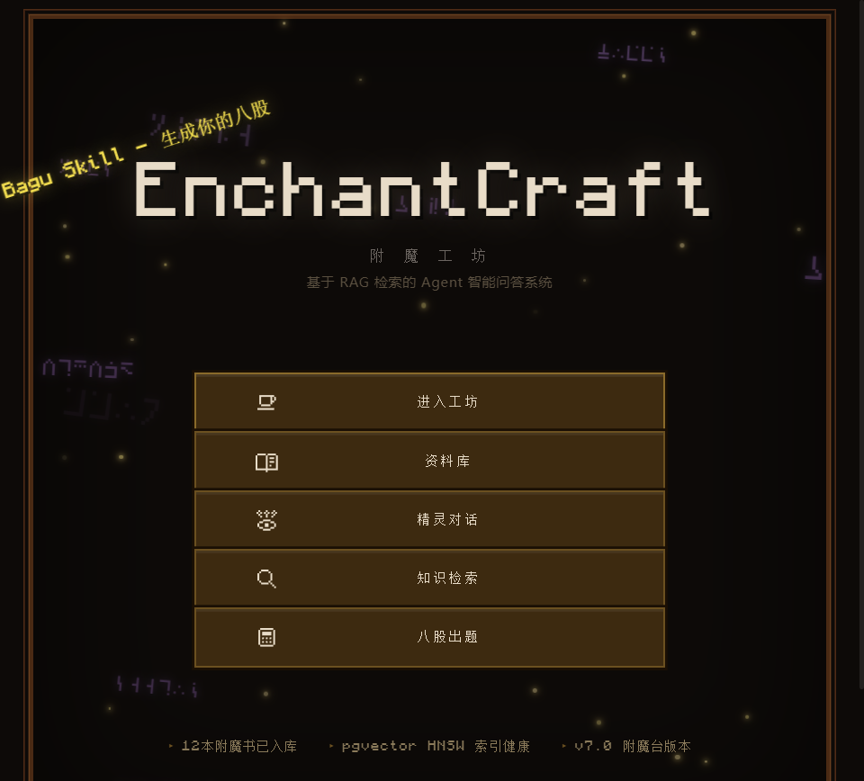
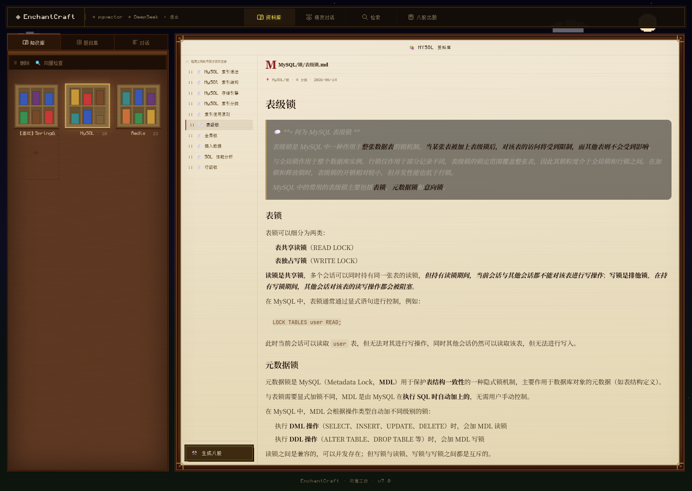
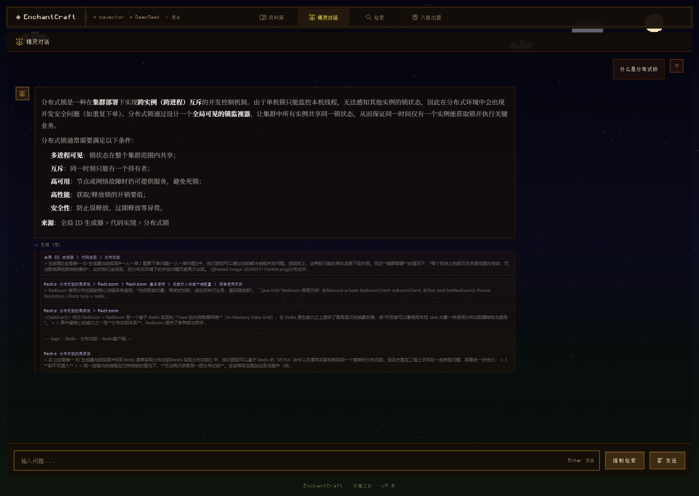
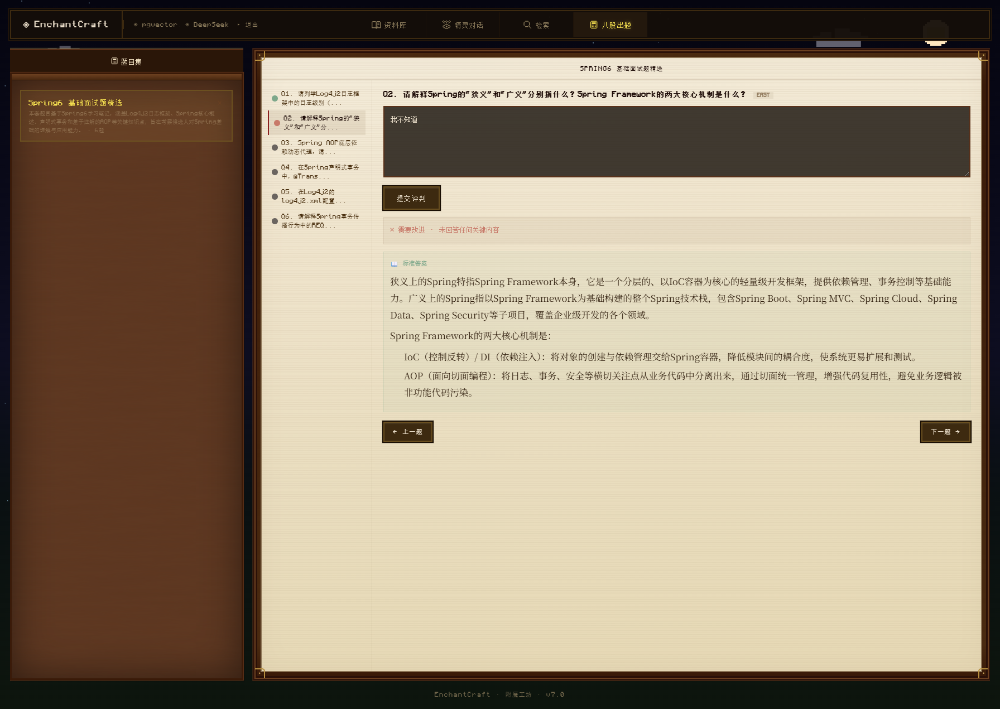
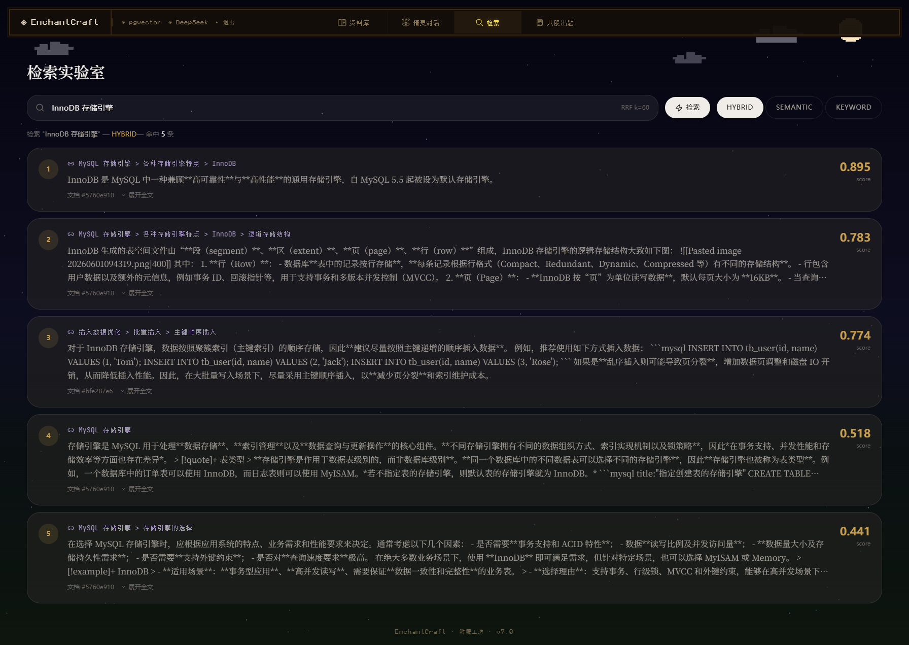
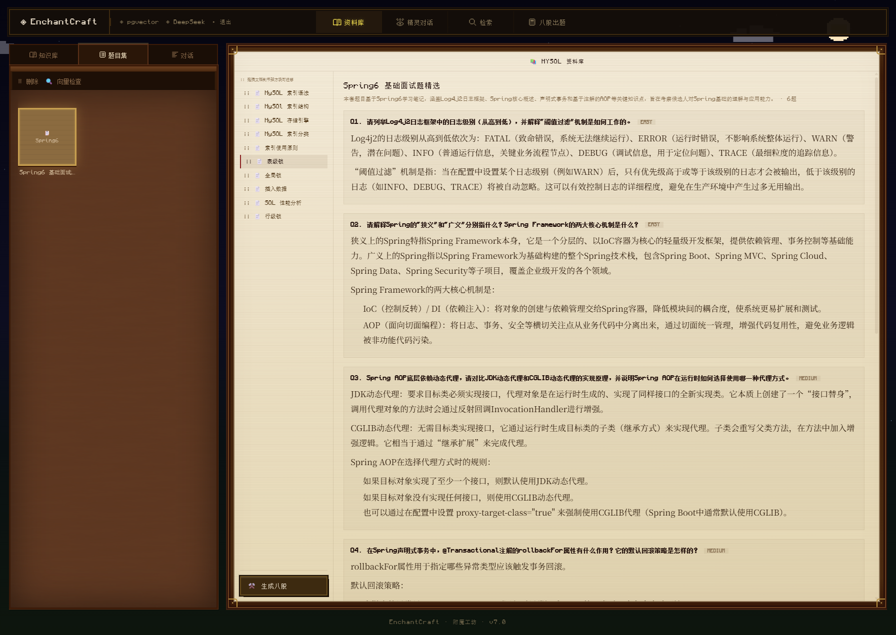

# EnchantCraft 附魔工坊

> 基于 RAG 检索增强生成的 Agent 智能问答系统 —— 从个人笔记到面试题库

**EnchantCraft** 是一个以 Minecraft 像素风格为主题的 AI 知识管理平台。用户上传 Markdown 学习笔记 → 系统自动分块、向量化 → 基于 RAG 的 Agent 进行智能检索与流式对话 → 一键生成结构化面试八股题库，支持 AI 评判答题质量。

---

## 技术栈

| 类别 | 技术 | 说明 |
|------|------|------|
| 语言 | Java 17 | - |
| 框架 | Spring Boot 3.4.3 | - |
| AI 框架 | LangChain4j 1.14.0 | OpenAiChatModel + OpenAiStreamingChatModel |
| 对话模型 | DeepSeek v4-pro | OpenAI 兼容协议 |
| Embedding | 阿里云 DashScope text-embedding-v3 | 1024维 |
| Rerank | 阿里云 DashScope gte-rerank-v2 | - |
| 向量存储 | PostgreSQL + pgvector | HNSW 索引 |
| 全文检索 | zhparser 中文分词 | GIN 索引 |
| ORM | MyBatis-Plus 3.5.16 | MySQL 业务数据 |
| 消息队列 | Apache Kafka 3.7.1 | 异步索引 |
| JWT | jjwt 0.12.6 | 认证鉴权 |
| 前端 | React 18 + Vite + TypeScript + Tailwind CSS v4 | MC 像素风 |
| 部署 | Nginx + Docker Compose | - |

---

## 功能模块

### 📚 知识资料库
- Markdown 文件上传（拖拽 / 目录扫描）
- flexmark AST 按标题层级分块
- MD5 幂等去重
- 雕纹书架 UI：按目录自动分组，书本密度可视化

### 🔍 智能检索
- 语义检索（pgvector HNSW 余弦相似度）
- 关键词检索（zhparser 中文分词）
- 混合检索（RRF 多路融合）
- gte-rerank-v2 重排序

### 🔮 精灵对话
- 流式 SSE 打字机效果
- 多轮对话记忆
- 查询改写（口语→关键词）
- 来源引用 + Markdown 渲染
- 强制检索 / 智能检索双模式

### ⚒️ 八股出题 (Bagu Skill)
- 选中资料库 → LLM 自动生成面试题
- 题目 + 标准答案 + 难度分级
- 逐题答题 + AI 评判（GOOD/OK/POOR）
- 答题状态持久化
- 题目集管理（查看 / 删除）

### 🔐 用户系统
- JWT 认证 + BCrypt 密码加密
- 角色权限（ADMIN / USER）
- 每日用量配额（检索 10 次 / 对话 10 轮）
- 跨天自动重置

---

## 项目结构（DDD 六模块 + 前端）

```
EnchantCraft/
├── QA-Agent-api/              API 契约 DTO
├── QA-Agent-types/            共享类型、常量、异常、Response
├── QA-Agent-domain/           领域模型 + 服务接口
│   ├── document/              文档域（上传、分块、检索、Embedding）
│   ├── agent/                 Agent 域（对话、记忆、Prompt、MCP）
│   ├── identity/              认证域（用户、JWT、配额）
│   └── bagu/                  八股域（出题、评判）
├── QA-Agent-infrastructure/   DAO/PO/Repository、PgVectorStore、Kafka
├── QA-Agent-trigger/          HTTP Controller、Kafka Consumer、定时Job
├── QA-Agent-app/              Spring Boot 启动 + 配置
├── frontend/                  React 前端（MC 像素风）
│   ├── src/pages/             WelcomePage / DocumentPage / AgentPage / BaguPage / SearchPage
│   └── src/lib/               McModal / API / agentStore / mockAuth
├── docs/
│   ├── dev-docs/              开发日志
│   ├── dev-ops/               Docker Compose + Nginx
│   ├── sql/                   建表/迁移 SQL
│   └── prompts/               Prompt 模板（外置热加载）
└── README.md
```

---

## 快速启动

### 环境要求
- Java 17+
- Node.js 18+
- Docker & Docker Compose
- 远程服务：MySQL 8.0 / PostgreSQL 17+pgvector / Kafka 3.7

### 后端启动
```bash
# 1. 克隆项目
git clone git@github.com:LunaticPum/PuDocManageAgent.git
cd PuDocManageAgent

# 2. 编译
mvn clean compile -DskipTests

# 3. 启动基础设施
cd docs/dev-ops
docker-compose -f docker-compose-env.yml up -d

# 4. 初始化数据库（首次）
mysql -h 134.175.232.110 -P 13306 -uroot -p123456 < docs/sql/init-qa-agent.sql

# 5. 启动应用
cd QA-Agent-app
mvn spring-boot:run -Dspring-boot.run.profiles=dev
```

### 前端启动
```bash
cd frontend
npm install
npm run dev      # 开发模式 → http://localhost:5173
npm run build    # 生产构建 → dist/
```

### Docker 部署
```bash
cd docs/dev-ops
docker-compose -f docker-compose-env.yml -f docker-compose-app.yml up -d
# 前端 → http://localhost:9090
```

---

## 截图

| 首页 | 知识库 |
|------|--------|
|  |  |

| 精灵对话 | 八股出题 |
|----------|----------|
|  |  |

| RAG 检索 | 题目集 |
|----------|--------|
|  |  |

---

## 作者

- 📧 邮箱：1637435385@qq.com
- 🐙 GitHub：[LunaticPum](https://github.com/LunaticPum)

## Star 趋势

[](https://star-history.com/#LunaticPum/PuDocManageAgent&date)

---

## 开发日志

| 版本 | 内容 |
|------|------|
| V1 | 框架搭建 + LangChain4j 配置 |
| V2 | 文档上传 + Markdown 分块 + Embedding + RAG 检索 |
| V3 | PostgreSQL pgvector 检索引擎 + zhparser 中文分词 |
| V4 | Agent 流式对话 + 多轮记忆 + MCP 工具 |
| V5 | 前端 MC 像素风设计 + SSE 打字机 + Kafka 异步 |
| V6 | JWT 认证 + 权限 + 配额 + 部署运维 |
| V7 | Bagu Skill 八股出题 + AI 评判 |

---

## 许可

MIT License · 联系邮箱 1637435385@qq.com
