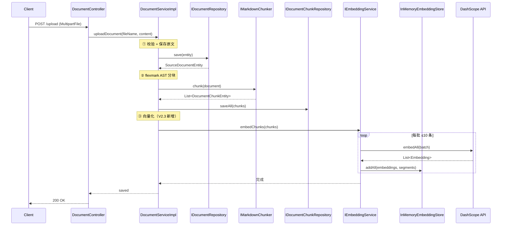
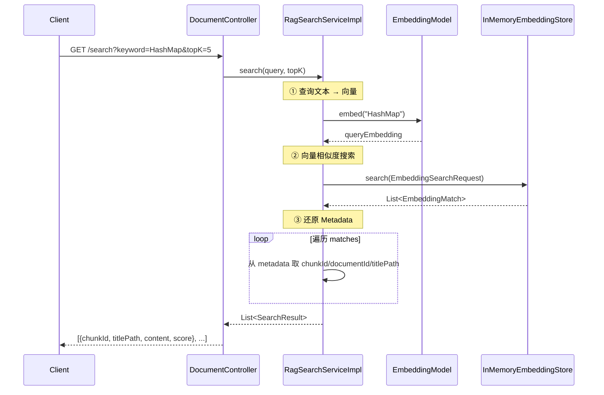

# Embedding + 语义检索

> [!note|center] Embedding 是什么
> Embedding（向量化/嵌入）是将文本映射到高维向量空间的一种技术。语义相近的文本在向量空间中距离较近，语义无关的文本距离较远。例如："HashMap 底层原理" 和 "ConcurrentHashMap 线程安全" 的向量距离会很近，但和 "Spring AOP 切面编程" 则会很远。
>
> 通过与 LLM 配合，我们可以先使用 Embedding 模型将文档内容转换为向量存入数据库，用户提问时同样将查询向量化，然后通过**余弦相似度**等算法在向量空间中搜索最接近的内容块，这就是 RAG（Retrieval-Augmented Generation）的"检索"部分。

## 模型选型

经过实践，DeepSeek 的 Embedding 模型已弃用，本系统改用**阿里云 DashScope** 提供的 Embedding 服务：

| 模型 | 用途 | 提供商 |
|------|------|--------|
| `text-embedding-v4` | 文本向量化（1024 维） | 阿里云 DashScope |
| `gte-rerank-v2` | 检索结果重排序（预留） | 阿里云 DashScope |
| `deepseek-v4-pro` | 对话生成 | DeepSeek |

> [!tip] 模型分离
> Chat 和 Embedding 使用不同的 API 端点——DeepSeek 负责对话，DashScope 负责向量化。这样做的好处是各取所长，且 Embedding 的调用频率远高于对话（每次上传文档都要对所有分块做向量化），分开计费更清晰。

配置结构如下：

```yaml title:"application-dev.yml"
deepSeek:
  model: "deepseek-v4-pro"
  base-url: "https://api.deepseek.com/v1"
  api-key: "sk-..."

dashScope:
  embedding-model: "text-embedding-v4"
  rerank-model: "gte-rerank-v2"        # 预留 V2.4
  base-url: "https://dashscope.aliyuncs.com/compatible-mode/v1"
  api-key: "sk-..."
```

> [!warning] Embedding 日志控制
> Embedding 请求的响应体是**完整的向量数组**（1024 维浮点数 × 文本条数），如果不关闭日志打印，日志文件会瞬间膨胀。在 `LangChain4jConfig` 中 Embedding 模型的 `logRequests` 和 `logResponses` 建议设为 `false`，只保留 Chat 模型的日志。

## 向量存储：InMemoryEmbeddingStore

V2 阶段使用 LangChain4j 内置的 `InMemoryEmbeddingStore<TextSegment>` 作为向量存储。它将向量数据保存在 JVM 堆内存中：

```java
@Bean
public EmbeddingStore<TextSegment> embeddingStore() {
    return new InMemoryEmbeddingStore<>();
}
```

> [!info] 为什么先用内存方案
> - **零配置**：不需要额外部署 PostgreSQL/pgvector 或 Milvus
> - **快速验证**：V2 阶段的数据量和 QPS 都不大，内存方案完全够用
> - **后续可替换**：`EmbeddingStore` 是 LangChain4j 的抽象接口，只要 Bean 换成 pgvector 实现即可平滑迁移

## Label 元数据设计

当我们将一条 chunk 文本向量化时，除了文本内容本身，还需要在 `TextSegment` 的 `Metadata` 中携带**检索后还原**所需的标识信息：

```java
Metadata metadata = new Metadata();
metadata.put("chunkId", chunk.getId());           // 分块 ID
metadata.put("documentId", chunk.getDocumentId()); // 所属文档 ID
metadata.put("titlePath", chunk.getTitlePath());   // 标题路径
TextSegment segment = TextSegment.from(chunk.getContent(), metadata);
```

> [!question] 为什么需要 Metadata
> 向量检索返回的是"哪些向量最相似"，但向量本身不携带任何业务信息——我们不知道它属于哪个文档、在文档的哪个章节。Metadata 就是在 Embedding 时一起存进去的业务标签，检索命中后可以直接从 `match.embedded().metadata()` 中还原这些标识。

## 上传流程整合

V2.3 在上传链路中增加了 Embedding 步骤，完整流程如下：



## 分批 Embedding

DashScope 的 Embedding API 有硬性限制：**单次请求最多 10 条文本**。如果文档分块超过 10 个，一次性发送会报 `InvalidParameter: batch size should not be larger than 10`。

解决方案：按 10 个一批循环发送：

```java
int batchSize = 10;
for (int i = 0; i < segments.size(); i += batchSize) {
    int end = Math.min(i + batchSize, segments.size());
    List<TextSegment> batch = segments.subList(i, end);

    // 每批独立请求 Embedding API
    Response<List<Embedding>> response = embeddingModel.embedAll(batch);
    List<Embedding> embeddings = response.content();

    // 立即存入向量存储
    embeddingStore.addAll(embeddings, batch);
}
```

> [!tip] 为什么完一批就存一批
> 如果等所有批次都 Embedding 完再统一存储，中间某批失败会导致前面已完成的 Embedding 结果丢失。边 Embed 边存可以确保失败时只需重试当前批次。

## 语义检索

检索服务 `RagSearchServiceImpl` 实现了从用户查询到命中结果的完整链路：



> [!info] LangChain4j 1.14.0 的 search API
> 注意 `EmbeddingStore` 的检索方法在 1.14.0 中是 `search(EmbeddingSearchRequest)` 而不是老版本的 `findRelevant(Embedding, int)`。`EmbeddingSearchRequest` 通过 builder 模式设置 `queryEmbedding`、`maxResults`、`minScore` 等参数，返回的 `EmbeddingSearchResult` 通过 `.matches()` 取结果列表。

检索接口：

```bash
# 返回最相似的 5 个分块，按相似度降序
curl "http://localhost:8091/api/v1/document/search?keyword=HashMap底层原理&topK=5"
```

响应示例：

```json
{
  "code": "0000",
  "data": [
    {
      "chunkId": "xxx-1",
      "documentId": "yyy",
      "titlePath": "Java基础 > 集合框架 > HashMap",
      "content": "HashMap 采用数组+链表+红黑树实现...",
      "score": 0.895
    },
    {
      "chunkId": "xxx-2",
      "documentId": "yyy",
      "titlePath": "Java基础 > 集合框架 > ConcurrentHashMap",
      "content": "ConcurrentHashMap 在 JDK 1.8 中...",
      "score": 0.762
    }
  ]
}
```

## 待解决问题

> [!warning] 事务与幂等（后续处理）
> 当前上传流程没有事务包裹——如果 Embedding 步骤失败，文档和分块已经入库但向量未生成，数据会不一致。
>
> 另外缺少重复上传校验，同一个文件上传两次会产生两份文档记录和重复向量。
>
> 这两个问题将在 V2.3 完成后统一处理。
