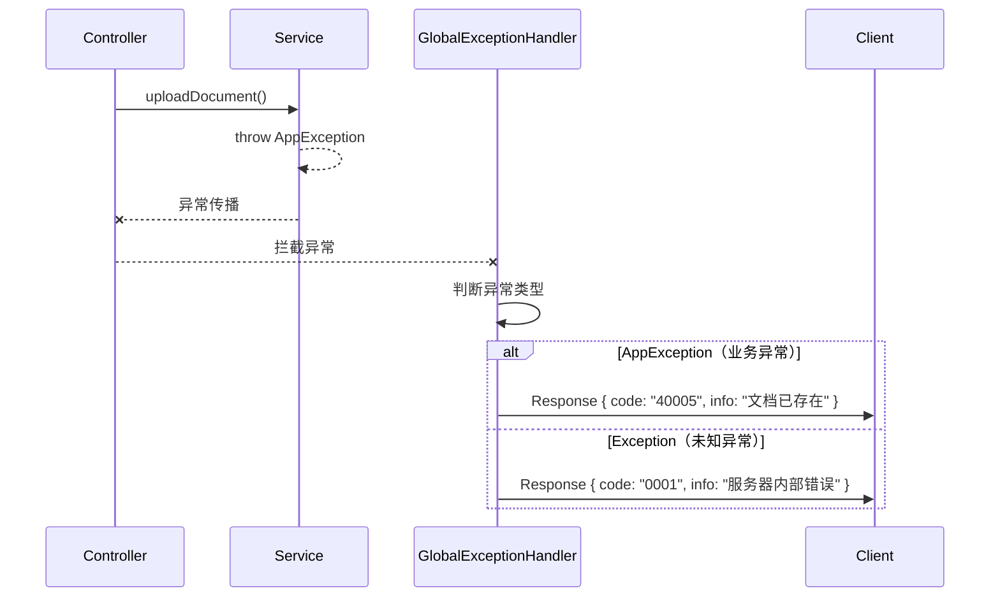
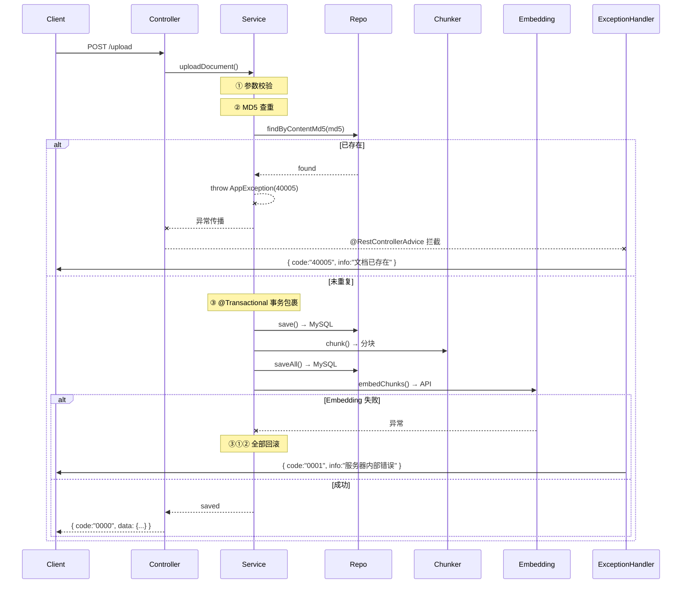

# 事务优化 + MD5 幂等 + 全局异常处理

> [!note|center] 为什么需要这些优化
> V2.3 跑通后暴露了两个问题：一是 Embedding 失败会导致文档和分块已入库但向量没生成（数据不一致），二是同一个文件能重复上传产生冗余数据。另外后端抛出的异常没有被统一包装，前端会收到非标准的错误响应。

## 事务保护

上传链路涉及三次写操作——文档入库、分块入库、向量生成。其中前两步走 MySQL，最后一步走外部 API。如果 Embedding 调用失败（网络抖动、API 限流等），虽然向量没生成，但文档和分块已经持久化了，后续无法自动恢复。

解决方案：在 `uploadDocument` 方法上加 `@Transactional(rollbackFor = Exception.class)`。

```java
@Override
@Transactional(rollbackFor = Exception.class)
public SourceDocumentEntity uploadDocument(String fileName, String content) {
    // ① save 文档 → ② chunk 分块 → ③ embed 向量化
    // 任何一步抛异常 → ①② 的 MySQL 写入全部回滚
}
```

> [!tip] 回滚范围
> `@Transactional` 只回滚 MySQL 操作（MyBatis-Plus 的 insert），`InMemoryEmbeddingStore` 是内存操作不受事务管理——但它是重启即丢的临时存储，所以不影响数据一致性。

> [!warning] spring-tx 依赖
> domain 模块原本没有 `spring-tx` 依赖，需要手动加入 `QA-Agent-domain/pom.xml`，否则 `@Transactional` 不会生效。

## MD5 内容查重

上传前先对文件内容计算 MD5 摘要，拿这个值去数据库查是否已存在相同内容的文档。

### 为什么用 MD5 而不是文件名

| 方案 | 优点 | 缺点 |
|------|------|------|
| 文件名查重 | 实现简单 | 改个文件名就能绕过（`笔记.md` → `笔记(1).md`） |
| MD5 查重 | 内容相同就能识别，改名无法绕过 | 多一步计算，需要额外字段 |

显然 MD5 更可靠——用户的核心诉求是"同一篇笔记不要存多份"，跟文件名无关。

### 实现步骤

**1. 表结构**

```sql
ALTER TABLE source_document
    ADD COLUMN content_md5 VARCHAR(32) NOT NULL DEFAULT '' 
        COMMENT '文档原始内容的 MD5 摘要，用于上传去重校验',
    ADD INDEX idx_content_md5 (content_md5);
```

> [!info] 为什么加索引
> 每次上传都要查 `content_md5` 列做去重判断，随着文档量增长，不加索引的查询会越来越慢。MD5 是定长 32 字符，索引效率很高。

**2. 实体层自动计算**

```java
// SourceDocumentEntity.create()
String md5 = DigestUtils.md5Hex(rawContent);    // commons-codec 提供
return SourceDocumentEntity.builder()
        // ...
        .contentMd5(md5)
        .build();
```

`DigestUtils.md5Hex()` 是 Apache Commons Codec 的工具方法，输入字符串，输出 32 位十六进制 MD5 字符串。

**3. 上传前查重**

```java
// DocumentServiceImpl.uploadDocument()
String contentMd5 = DigestUtils.md5Hex(content);
documentRepository.findByContentMd5(contentMd5).ifPresent(existing -> {
    throw new AppException(ResponseCode.DOCUMENT_DUPLICATE.getCode(),
            "文档内容重复，已存在: " + existing.getFileName());
});
```

查到就抛 `DOCUMENT_DUPLICATE`（40005），配合 `@Transactional` 不会产生任何脏数据。

## 全局异常处理

之前 Service 层抛出的 `AppException` 会被 Spring 默认处理成 500 错误加上一大段堆栈信息——这种响应对前端不友好，格式也不统一。

用 `@RestControllerAdvice` 拦截所有异常并统一包装为 `Response<T>`：



```java
@Slf4j
@RestControllerAdvice
public class GlobalExceptionHandler {

    @ExceptionHandler(AppException.class)
    public Response<Void> handleAppException(AppException e) {
        log.warn("[异常处理] 业务异常: code={}, message={}", e.getCode(), e.getMessage());
        return Response.<Void>builder()
                .code(e.getCode())
                .info(e.getMessage())
                .build();
    }

    @ExceptionHandler(Exception.class)
    public Response<Void> handleException(Exception e) {
        log.error("[异常处理] 未知异常", e);
        return Response.<Void>builder()
                .code(ResponseCode.UN_ERROR.getCode())
                .info("服务器内部错误: " + e.getMessage())
                .build();
    }
}
```

> [!tip] 两种异常的区别
> - `AppException`：我们自己抛出的业务异常，code 和 message 都是可控的，直接透传给前端
> - `Exception`：意料之外的异常（NPE、网络异常、数据库异常等），code 固定为 `UN_ERROR(0001)`，但 message 仍返回给前端方便定位问题

从此 Controller 不再需要手动 try-catch，代码干净很多。

## 新增错误码

| 错误码 | 枚举 | 说明 |
|--------|------|------|
| 40005 | `DOCUMENT_DUPLICATE` | 文档内容重复（MD5 命中） |
| - | `GlobalExceptionHandler` | `AppException` 直接透传，`Exception` 兜底为 0001 |

## 完整上传链路（优化后）


