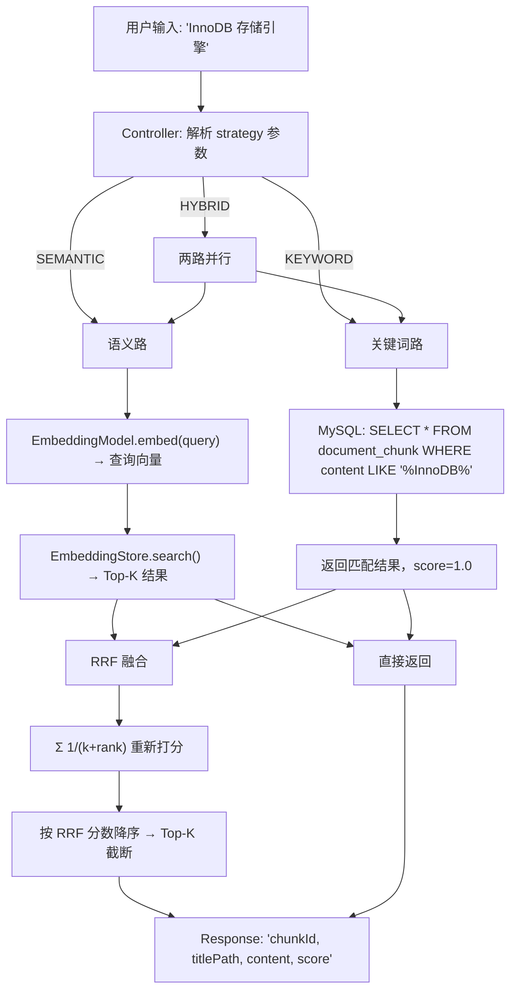

# 混合检索 + RRF 多路融合

> [!note|center] 单路检索的局限
> V2.3 的语义检索在大部分场景下表现不错，但实践中发现一个明显的问题：当用户搜索的词语在 Embedding 模型的训练语料中出现较少时（如专业术语、代码中的类名、缩写），语义向量可能无法准确捕捉其含义，导致召回率为 0。
>
> 例如搜索"InnoDB"——这个 MySQL 存储引擎名称对通用 Embedding 模型来说并不常见，但文档中明确包含这个词。纯靠语义向量，它和"MySQL 存储引擎"的向量距离不够近；而用最简单的 SQL `LIKE` 却能精准命中。
>
> 这就是为什么要引入**混合检索**——不同检索策略各有所长，组合使用可以互相填补盲区。

## 为什么要多路召回

检索系统的核心矛盾可以归结为两点：

| 矛盾 | 说明 | 例子 |
|------|------|------|
| **语义 vs 字面** | 语义检索能理解"汽车"≈"轿车"，但可能漏掉"B+树"这类专业术语 | "数据库索引结构" → 语义能召回 B+树相关内容；但反过来搜"B+树"语义可能没反应 |
| **精确 vs 召回** | 关键词匹配精度高但换一种说法就搜不到，语义检索覆盖面广但区分度可能不够 | "HashMap 咋实现的" → 关键词搜不到（没写"咋实现"这几个字），但语义能定位到"HashMap 底层原理" |

多路召回的思想就是**同时用多条策略线检索，再把各路的结果融合起来**——让每条策略发挥自己的优势，互相补位。

## 常见的混合检索方法

> [!info] 三种主流融合策略

### 1. 线性加权（Weighted Sum）

最简单的方案——给两路结果各自一个权重，按加权分数排序：

```
final_score = α × semantic_score + (1-α) × keyword_score
```

- 优点：实现简单，调一个参数就行
- 缺点：两路分数的量纲不统一（语义相似度是 0~1 的余弦值，关键词匹配没有天然分数），归一化很麻烦

### 2. 学习排序（Learning to Rank）

用机器学习模型来学习如何融合——训练一个 LTR 模型，输入各路分数和文档特征，输出最终排序。

- 优点：如果有足够的标注数据，效果最好
- 缺点：需要标注数据、训练成本高、在线推理有延迟，对小项目过度设计

### 3. RRF（Reciprocal Rank Fusion）

只关心**排名**，不关心具体分数：

```
RRF_score = Σ 1/(k + rank_i)
```

其中 `rank_i` 是该文档在第 i 路检索结果中的排名（从 1 开始），`k` 是平滑常数（通常取 60）。

- 优点：不需要关心各路分数的量纲，只比排名，天然适合异构检索系统
- 缺点：丢失了各路的原始分数信息

> [!tip] 我们选 RRF 的原因
> 语义路的分数是余弦相似度（0~1 的连续值），关键词路没有天然分数（取决于 `LIKE` 返回顺序或匹配长度），量纲根本不统一。RRF 直接用排名做融合，完美规避了归一化问题，而且计算成本极低——几行代码的事。

## RRF 实现原理

### 核心公式

对于任意一个文档 chunk，它在多路检索结果中的 RRF 分数为：

```
RRF(chunk) = Σ_i  1 / (k + rank_i(chunk))
```

其中：
- `i` 遍历所有检索策略（语义路、关键词路）
- `rank_i(chunk)` 是该 chunk 在第 i 路结果中的排名，从 1 开始
- 如果该 chunk 在某路结果中没有出现，则该项不参与累加
- `k` 是平滑常数（本系统取 60），作用是避免排名靠前的 chunk 分数过于悬殊

> [!question] k=60 的作用
> 假设没有 k（即 k=0），排名第 1 的 chunk RRF 分数为 `1/1 = 1.0`，排名第 10 的为 `1/10 = 0.1`，差了 10 倍。加上 k=60 后，第 1 名为 `1/61 ≈ 0.0164`，第 10 名为 `1/70 ≈ 0.0143`，差距大大缩小。k 值越大，排名差异越平滑；k=60 是学术界常用的经验值。

### 计算示例

假设搜索"InnoDB 存储引擎"，语义路和关键词路各返回 Top-5：

| 排名 | 语义路 | 关键词路 |
|------|--------|----------|
| 1 | chunk-A: "MyISAM 引擎..." | chunk-C: "InnoDB 是 MySQL 的..." |
| 2 | chunk-B: "存储引擎对比..." | chunk-D: "InnoDB 特点包括..." |
| 3 | chunk-E: "MySQL 架构..." | chunk-E: "MySQL 架构..." |
| 4 | chunk-F: "数据库优化..." | chunk-A: "MyISAM 引擎..." |
| 5 | chunk-G: "事务隔离级别..." | chunk-B: "存储引擎对比..." |

RRF 融合计算：

| chunk | 语义 rank | 关键词 rank | RRF 计算 | RRF 分数 | 最终排名 |
|-------|----------|------------|----------|----------|----------|
| chunk-E | 3 | 3 | 1/(60+3) + 1/(60+3) | **0.0317** | 1 |
| chunk-A | 1 | 4 | 1/(60+1) + 1/(60+4) | **0.0320** | 2 |
| chunk-B | 2 | 5 | 1/(60+2) + 1/(60+5) | **0.0315** | 3 |
| chunk-C | - | 1 | 0 + 1/(60+1) | **0.0164** | 4 |
| chunk-D | - | 2 | 0 + 1/(60+2) | **0.0161** | 5 |
| chunk-F | 4 | - | 1/(60+4) + 0 | **0.0156** | 6 |

> [!note] 观察
> chunk-E 在两路中都排第 3，融合后升到第 1——这就是 RRF 的核心价值：**同时被多路检索命中的 chunk 会获得更高的综合排名**。
>
> 而只在一路中出现的 chunk-C（仅关键词命中）虽然关键词路排第 1，融合后只排第 4——这很合理，因为语义路没找到它，说明它跟查询的语义相关性确实不够强。

### 代码实现

```java
private static final double RRF_K = 60.0;

private void accumulateRrf(List<SearchResult> results,
                            Map<String, SearchResult> chunkMap,
                            Map<String, Double> rrfScores,
                            String source) {
    for (int i = 0; i < results.size(); i++) {
        SearchResult r = results.get(i);
        String chunkId = r.getChunkId();
        // rank = i + 1（从 1 开始）
        double rrf = 1.0 / (RRF_K + i + 1);
        // 多路结果累加 RRF 分数
        rrfScores.merge(chunkId, rrf, Double::sum);
        // 同一 chunk 只保留第一次出现的结果对象（语义路优先）
        chunkMap.putIfAbsent(chunkId, r);
    }
}
```

## 检索策略切换

V2.4 的检索接口支持三种策略，通过 `strategy` 参数切换：

```bash
# 混合检索（默认）—— 语义 + 关键词 → RRF 融合
curl "localhost:8091/api/v1/document/search?keyword=InnoDB"

# 仅语义检索
curl "localhost:8091/api/v1/document/search?keyword=InnoDB&strategy=SEMANTIC"

# 仅关键词检索
curl "localhost:8091/api/v1/document/search?keyword=InnoDB&strategy=KEYWORD"
```

## 检索全链路



## 实际效果

以"MySQL 存储引擎.md"笔记为例：

| 搜索词 | 语义命中 | 关键词命中 | 混合命中 | 说明 |
|--------|---------|-----------|---------|------|
| "存储引擎" | 5 条 | 5 条 | 5 条（两路互补排序） | 常用词，两路各有优势 |
| "InnoDB" | **0 条** | 5 条 | 5 条（关键词路兜底） | 专业术语，语义模型覆盖不足 |

语义路的盲区被关键词路完美填补——这正是混合检索设计的初衷。
