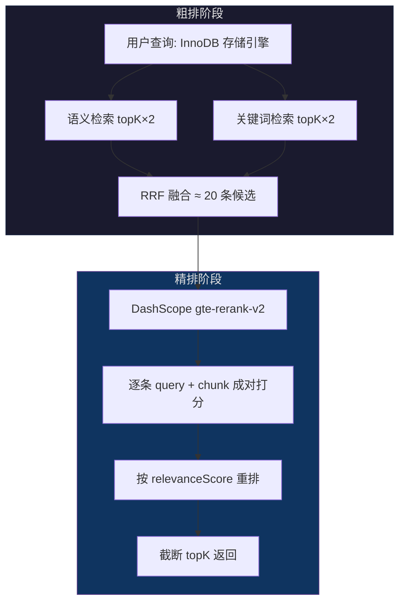
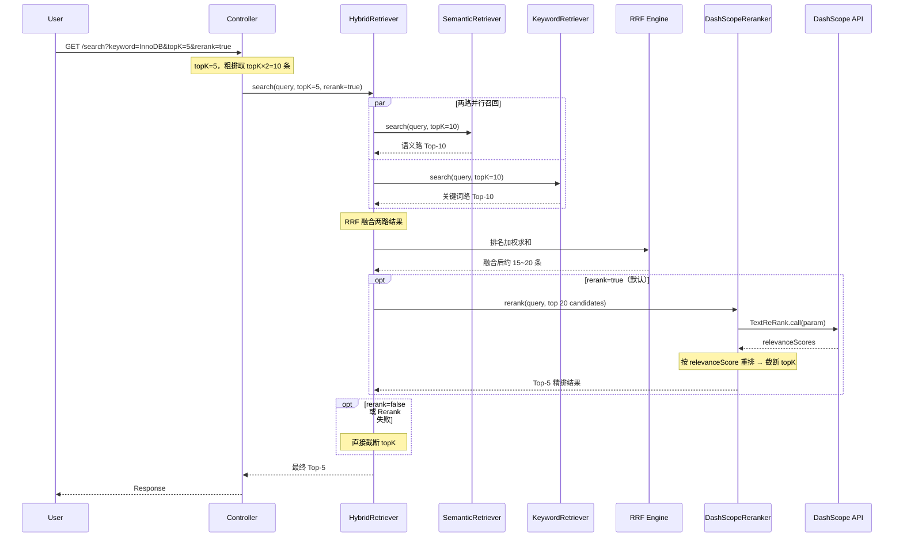

# Rerank 重排序 + DashScope SDK

> [!note|center] 粗排 vs 精排
> V2.4 的混合检索本质上是一套**粗排**系统——通过向量相似度和关键词匹配快速从海量分块中筛选出候选集。但粗排有一个固有缺陷：它只能通过"间接信号"来判断相关性。
>
> 向量相似度衡量的是 query 和 chunk 在 Embedding 空间的夹角，关键词匹配只看字面重叠——两者都没有真正理解 query 和候选文本之间的深层语义关系。Rerank（重排序）就是一个**精排**步骤，把粗排产出的候选集逐一用专门的排序模型做精细比对。

## 为什么需要 Rerank

粗排和精排的区别可以用一个类比来理解：

| | 粗排（Embedding + RRF） | 精排（Rerank） |
|------|------|------|
| 类比 | 图书馆员根据索引快速找到相关书架的几本书 | 专家坐下来逐本仔细翻看，给你排个推荐顺序 |
| 判断方式 | 向量距离 / 关键词匹配 —— 间接信号 | 将 query 和每条文本**成对**送入模型 —— 直接理解 |
| 速度 | 快（向量索引 + SQL LIKE） | 慢一些（每条候选都要跑一次模型推理） |
| 输入量 | 可以处理全量数据 | 通常只对 Top-20 条候选做重排 |

Embedding 模型做的是"把文本映射为向量"，它只看单个文本；Rerank 模型做的是"判断两个文本之间的相关性"，它同时看 query 和候选文本，输出一个 0~1 的相关性分数。两者的设计目标根本不同。

> [!tip] 举个实际例子
> 搜索"InnoDB 存储引擎"时，有一个 chunk 的内容是"MySQL 的存储引擎主要有 MyISAM 和 InnoDB 两种..."——这段文本在向量空间中可能因为"MySQL""存储引擎""MyISAM"等词的干扰，和"InnoDB 存储引擎"的向量相似度并不高。但 Rerank 模型能直接理解"这段文本在讲 InnoDB 是 MySQL 的存储引擎之一"，给出更高的相关性分数。

## 粗排 + 精排的二阶段架构



核心思想：**粗排用低成本方案做大范围过滤，精排用高质量模型做小范围重排**。这样既保证了召回率（粗排不会漏掉相关 chunk），又保证了精度（精排把最相关的排到前面）。

## 阿里云百炼重排模型：gte-rerank

阿里云 DashScope（百炼平台）提供 `gte-rerank-v2` 重排序模型，专门用于对检索结果做精排：

- **输入**：一个 query 字符串 + 最多 20 条候选文档文本
- **输出**：每条候选文档的 `relevanceScore`（Double，0~1）+ 在原列表中的 `index`
- **模型特点**：基于 GTE（General Text Embeddings）系列，专门训练来理解 query-document 对的相关性

官方 Java SDK 使用方式：

```xml title:"pom.xml"
<dependency>
    <groupId>com.alibaba</groupId>
    <artifactId>dashscope-sdk-java</artifactId>
    <version>2.22.17</version>
</dependency>
```

```java
TextReRankParam param = TextReRankParam.builder()
        .apiKey(apiKey)
        .model("gte-rerank-v2")
        .query("InnoDB 存储引擎")              // 原始查询词
        .documents(List.of(                    // 候选文本列表
            "MySQL 的存储引擎主要有 MyISAM 和 InnoDB...",
            "InnoDB 是 MySQL 默认存储引擎..."
        ))
        .build();

TextReRankResult result = new TextReRank().call(param);

for (TextReRankOutput.Result r : result.getOutput().getResults()) {
    r.getIndex();           // 0 — 对应 candidates 中的位置
    r.getRelevanceScore();  // 0.9521 — 相关性分数
}
```

> [!info] DashScope SDK 对标 LangChain4j
> 原项目 QA-Agent 的 Embedding 和 Rerank 都用 DashScope 原生 SDK，没用 LangChain4j 的抽象。我们项目在 Embedding 上用了 LangChain4j（因为走 OpenAI 兼容协议更简单），Rerank 则对齐原项目——用 DashScope 原生 SDK。因为 LangChain4j 没有提供 OpenAi 协议的 Rerank 适配器，直接用原生 SDK 更省事。

## 容错降级机制

Rerank 是外部 API 调用，天然存在失败风险——网络抖动、API 限流、账户欠费等都可能导致调用失败。如果每次失败都直接抛异常，检索功能就完全不可用了。

我们的设计：**Rerank 失败时静默回退到 RRF 原始排序结果**。

```java
try {
    TextReRankResult result = new TextReRank().call(param);
    // ... 重排序逻辑
} catch (Exception e) {
    log.warn("[Rerank] 调用失败，回退原始排序: {}", e.getMessage());
    return candidates;  // 直接返回粗排结果，不抛异常
}
```

这样即使 Rerank 服务宕机，用户依然能拿到 RRF 粗排结果——虽然排序精度有所下降，但功能不受影响。

## 检索全链路（最终版）



## 使用方式

```bash
# 默认：混合检索 + Rerank 精排
curl "localhost:8091/api/v1/document/search?keyword=InnoDB&topK=5"

# 关闭 Rerank，回退到纯 RRF
curl "localhost:8091/api/v1/document/search?keyword=InnoDB&rerank=false"
```

通过 `rerank` 开关，可以自由控制是否启用精排——方便对比 Rerank 前后的排序差异。

## Rerank 的局限性

> [!warning] 小规模数据的收益有限
> 如果你只上传了一两篇文档，粗排结果本来就只有寥寥几条，Rerank 基本只是在把 5 条结果重新排个序，对最终效果提升不明显。Rerank 的价值在**候选池大、文档多样性高**的场景下才真正体现出来——当粗排返回了 20 条覆盖不同主题的 chunk 时，Rerank 能精准挑出最相关的几条。

另外，Rerank 调用有额外的延迟和 API 费用，后续对延迟敏感的场景可以考虑做缓存或异步处理。
