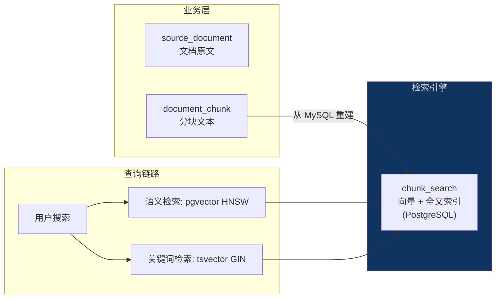

# PostgreSQL + pgvector 部署与配置

> [!note|center] 为什么需要 PostgreSQL
> V2 阶段我们用了两个临时方案：向量存储在 `InMemoryEmbeddingStore`（JVM 内存），关键词检索用 MySQL `LIKE`（全表扫描）。这两个方案在小数据量时没问题，但都有明显的瓶颈：
>
> - **内存向量存储**：应用重启数据全丢，每次启动要重新对所有文档做 Embedding；chunk 多了以后直接 OOM
> - **MySQL LIKE**：没有索引优化，每次查询都是全表扫；不懂中文分词，"存储引擎"和"引擎存储"对它来说就是两个不同的字面串
>
> PostgreSQL + `pgvector` + `zhparser` 就是来解决这两个问题的——把向量数据持久化到硬盘，同时给全文搜索装上专业的中文分词引擎。

## pgvector 是什么

`pgvector` 是 PostgreSQL 的一个扩展插件，它为 PostgreSQL 增加了：

| 能力 | 原生 MySQL | pgvector |
|------|-----------|----------|
| 向量数据类型 | 不支持 | `vector(N)` 类型，N 为维度 |
| 向量索引 | 无 | HNSW 索引，近似最近邻搜索 |
| 向量距离计算 | 无 | 余弦距离 `<=>`、欧氏距离 `<->`、内积 `<#>` |
| 中文分词全文搜索 | 无 | 配合 `zhparser` 做中文分词 + GIN 倒排索引 |

> [!info] HNSW 索引
> HNSW（Hierarchical Navigable Small World）是一种近似最近邻搜索算法。相比于暴力遍历所有向量（O(n) 复杂度），HNSW 能通过对数跳转在毫秒级找到最相似的向量。pgvector 的 HNSW 实现专为向量搜索优化，在生产环境中广泛应用。

## Docker 部署

使用 `pgvector/pgvector:pg17` 镜像，它基于 PostgreSQL 17 并预装了 pgvector 扩展：

```yaml title:"docker-compose-environment.yml"
postgres:
  image: pgvector/pgvector:pg17
  container_name: postgres
  restart: always
  environment:
    TZ: Asia/Shanghai
    POSTGRES_USER: root
    POSTGRES_PASSWORD: 123456
    POSTGRES_DB: qa_agent
  ports:
    - "15432:5432"          # 宿主机 15432 → 容器 5432
  volumes:
    - ./postgres/data:/var/lib/postgresql/data
    - ./postgres/init:/docker-entrypoint-initdb.d
  healthcheck:
    test: ["CMD-SHELL", "pg_isready -U root -d qa_agent"]
```

> [!tip] 端口选择
> MySQL 用了 13306，PostgreSQL 用 15432——都加了 10000 偏移方便区分，也避免和本地已有的数据库端口冲突。

## chunk_search 表设计

PostgreSQL 中的 `chunk_search` 表是 RAG 检索引擎的核心：

```sql
CREATE EXTENSION IF NOT EXISTS vector;     -- pgvector 向量扩展
CREATE EXTENSION IF NOT EXISTS zhparser;   -- 中文分词扩展

CREATE TABLE IF NOT EXISTS chunk_search (
    chunk_id     VARCHAR(36) PRIMARY KEY,           -- 关联 MySQL document_chunk.id
    embedding    vector(1024),                      -- DashScope text-embedding-v4 (1024维)
    content_tsv  tsvector,                          -- 中文分词全文索引
    title_path   TEXT,                              -- 标题路径
    module_tags  JSONB,                             -- 模块标签
    created_at   TIMESTAMP NOT NULL DEFAULT NOW(),
    updated_at   TIMESTAMP NOT NULL DEFAULT NOW()
);

-- HNSW 向量索引（余弦距离）
CREATE INDEX idx_chunk_search_embedding
    ON chunk_search USING hnsw (embedding vector_cosine_ops);

-- GIN 全文索引
CREATE INDEX idx_chunk_search_content_tsv
    ON chunk_search USING GIN (content_tsv);

-- 标签索引
CREATE INDEX idx_chunk_search_module_tags
    ON chunk_search USING GIN (module_tags);
```

> [!note] 与 MySQL 的关系
> - **MySQL `document_chunk`**：业务真数据——分块文本、标题路径、模块标签的持久化存储
> - **PostgreSQL `chunk_search`**：检索引擎副本——向量 + 全文索引 + 标签索引，只做查询，不参与业务 CRUD
> - 数据可以从 `document_chunk` 全量重建，PostgreSQL 不构成独立数据源

## 双数据源架构

V3 引入 PostgreSQL 后，项目变成双数据源：

| 数据库 | 职责 | 连接信息 |
|------|------|------|
| MySQL | 业务数据（文档、分块、任务） | `134.175.232.110:13306` |
| PostgreSQL | RAG 检索引擎（向量、全文） | `localhost:15432` |



## 下一步

V3.1 只是把 PostgreSQL 跑起来、建好表。V3.2 将引入 `langchain4j-pgvector`，用 `PgVectorEmbeddingStore` 替换 `InMemoryEmbeddingStore`，让 Embedding 向量真正持久化。
