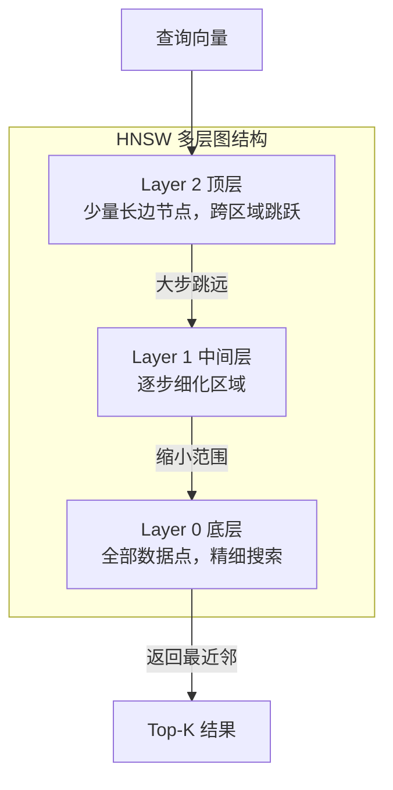
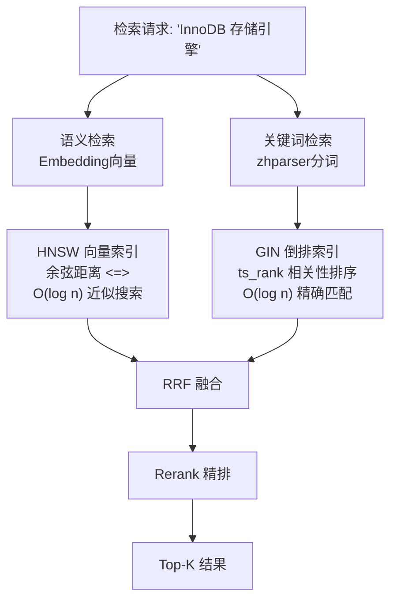

# JdbcTemplate 手写 PgVectorStore 替换内存存储

> [!note|center] V3.2 做什么
> 用自定义的 `PgVectorStore`（基于 Spring `JdbcTemplate` + 手写 SQL）替换 V2 的 `InMemoryEmbeddingStore`，让向量数据从 JVM 内存迁移到 PostgreSQL pgvector，具备持久化 + 索引加速能力。

## 为什么不用 langchain4j-pgvector

原项目 QA-Agent 也**没有引入** `langchain4j-pgvector` 这个包——它直接手写 JDBC SQL 操作 pgvector。我们查了 Maven Central，`langchain4j-pgvector` 在 LangChain4j 1.14.0 的 BOM 中不存在（该模块是后来版本才加入的）。所以走原项目的路线：**JdbcTemplate + 手写 SQL**。

这反而更灵活——我们可以完全控制 SQL 写法、表结构、索引策略，不受框架黑盒限制。

## 双数据源配置（踩坑记录）

V3 引入 PostgreSQL 后，项目同时连接 MySQL 和 PostgreSQL。这看起来简单，但 Spring Boot 的双数据源配置有几个容易忽略的细节，我们踩了不少坑。

### 最终方案：一个自动，一个内部

```java
// MySQL → Spring Boot 自动配置（spring.datasource.*），生成 dataSource Bean
// PostgreSQL → LangChain4jConfig 内部 new HikariDataSource()，不暴露为 Spring Bean

@Configuration
public class LangChain4jConfig {

    @Value("${pg.datasource.url}")
    private String pgUrl;
    @Value("${pg.datasource.username}")
    private String pgUsername;
    @Value("${pg.datasource.password}")
    private String pgPassword;
    @Value("${pg.datasource.driver-class-name}")
    private String pgDriver;

    @Bean
    public EmbeddingStore<TextSegment> embeddingStore() {
        // 内部创建，不暴露为 Spring Bean——避免干扰 MySQL 的自动配置
        HikariDataSource dataSource = new HikariDataSource();
        dataSource.setJdbcUrl(pgUrl);
        dataSource.setUsername(pgUsername);
        dataSource.setPassword(pgPassword);
        dataSource.setDriverClassName(pgDriver);
        dataSource.setMinimumIdle(2);
        dataSource.setMaximumPoolSize(10);
        return new PgVectorStore(dataSource);
    }
}
```

```yaml title:"application-dev.yml"
# MySQL：Spring Boot 标准命名空间，自动配置
spring:
  datasource:
    url: jdbc:mysql://134.175.232.110:13306/qa_agent?...
    username: root
    password: 123456

# PostgreSQL：独立命名空间 pg.*，不和 spring.* 冲突
pg:
  datasource:
    url: jdbc:postgresql://134.175.232.110:15432/qa_agent
    username: root
    password: 123456
    driver-class-name: org.postgresql.Driver
```

### 为什么绕了这么多弯

| 尝试 | 方式 | 结果 | 原因 |
|------|------|------|------|
| 1 | 手动创建 `postgresDataSource` Bean，MySQL 交给自动配置 | ❌ MySQL 自动配置被跳过 | Spring 的 `@ConditionalOnMissingBean(DataSource.class)` —— 只要存在任何 `DataSource` Bean，就不再自动创建 |
| 2 | 两个 DataSource 都手动创建 + `@Primary` | ❌ MySQL `jdbcUrl` 缺失 | `DataSourceBuilder` + `@ConfigurationProperties` 在同时有两份配置时属性绑定混乱 |
| 3 | `HikariConfig` + `@ConfigurationProperties` | ❌ `jdbcUrl is required` | `HikariConfig` 不直接支持 `@ConfigurationProperties` 的属性映射方式 |
| **4** | **MySQL 自动配置 + PostgreSQL 内部 `new HikariDataSource()`** | **✅ 成功** | PostgreSQL DataSource 不作为 Bean 暴露，完全不影响 Spring Boot 对 MySQL 的自动配置 |

> [!tip] 经验教训
> Spring Boot 的双数据源，最简单的方式是**只保留一个自动配置，另一个完全手动管理**。如果两个都作为 Bean 暴露，就会出现各种 `@Primary`、`@Qualifier` 的反复拉扯。

## PostgreSQL 索引：写给没接触过的人

PostgreSQL 传统上以"MySQL 的进阶版"著称，但它的核心优势不在增删改查，而在**索引系统**。下面按从易到难介绍 V3 用到的两种索引。

### 1. GIN 倒排索引（Generalized Inverted Index）

**理解它的最好方式是类比书的索引页。**

一本 500 页的计算机书，你想找所有提到"红黑树"的地方。没有索引 = 逐页翻看（全表扫）。有索引 = 翻到书末尾的索引页，找到"红黑树"，后面写着 p.23, p.89, p.156（倒排索引），直接跳过去就行。

```sql
-- 创建 GIN 索引
CREATE INDEX idx_chunk_search_module_tags
    ON chunk_search USING GIN (module_tags);
```

```
表中的 JSONB 数据：
  chunk-1: ["java", "集合"]
  chunk-2: ["mysql", "存储引擎"]
  chunk-3: ["java", "多线程"]

GIN 索引内部（倒排列表）：
  "java"     → chunk-1, chunk-3
  "集合"     → chunk-1
  "mysql"    → chunk-2
  "存储引擎" → chunk-2
  "多线程"   → chunk-3
```

查询 `module_tags @> '["java"]'` 时，直接查 GIN 索引 → 命中 chunk-1, chunk-3 → 不用扫全表。

> [!info] B+Tree vs GIN
> MySQL 的 B+Tree 索引适合"值精确匹配或范围查找"（如 `WHERE id = 5`），不适合"数组里包含某个元素"或"文本中匹配关键词"这种场景。GIN 索引专门为这类"包含"查询设计。

### 2. HNSW 向量索引（Hierarchical Navigable Small World）

**用于语义搜索的高维向量近似搜索。**

传统的 B+Tree 索引管一维数据（数字大小），GIN 索引管"包含"关系。但向量是 1024 维空间中的点，要在 1024 个维度中找最接近的邻居——没有任何传统索引能高效处理。

HNSW 采用多层图结构的思路：



搜索流程：从顶层稀疏图出发，先做跨区域的大步跳跃（类似于在世界地图上先定位亚洲 → 中国 → 广东），逐层向下细化（城市 → 街道），最终只在底层做小范围精确距离计算。全程不需要和全量数据逐一比较。

```sql
-- 创建 HNSW 索引（余弦距离版本）
CREATE INDEX idx_chunk_search_embedding
    ON chunk_search USING hnsw (embedding vector_cosine_ops);
```

### 三种索引怎么配合



## PgVectorStore 实现细节

### 为什么实现 EmbeddingStore 接口

LangChain4j 的 `EmbeddingStore<TextSegment>` 是我们项目中所有检索代码依赖的接口。`EmbeddingServiceImpl` 用它存向量，`SemanticRetrieverImpl` 用它查向量。只要新实现也遵循这个接口，上游代码**零改动**。

### 插入：batchUpdate 批量写入

```java
String sql = """
        INSERT INTO chunk_search (chunk_id, document_id, embedding,
                                  title_path, content, module_tags)
        VALUES (?, ?, ?::vector, ?, ?, ?::jsonb, NOW(), NOW())
        """;

List<Object[]> batchArgs = new ArrayList<>();
for (int i = 0; i < embeddings.size(); i++) {
    batchArgs.add(new Object[]{
            chunkId,
            documentId,
            vectorToString(embeddings.get(i).vector()),  // float[] → "[0.1,0.2,...]"
            titlePath,
            content,
            toJsonbArray(moduleTags)                     // "java,集合" → '["java","集合"]'
    });
}
jdbc.batchUpdate(sql, batchArgs);  // 一次性批量执行
```

`jdbc.batchUpdate()` 是 Spring 提供的批量 SQL 执行方法，内部用 JDBC 的 PreparedStatement batch 机制，比逐条 insert 快很多。

> [!info] `?::vector` 和 `?::jsonb` 类型转换
> JDBC 参数占位符 `?` 默认只能传基本类型（String、Integer 等）。pgvector 的 `vector` 类型和 PostgreSQL 的 `jsonb` 类型 JDBC 不认识。解决方案：把数据预先转成字符串格式，再通过 PostgreSQL 的 `::vector` / `::jsonb` 强制类型转换。原项目 QA-Agent 也是这么做的。

### 检索：`<=>` 余弦距离运算符

```java
String sql = """
        SELECT chunk_id, document_id, title_path, content, module_tags,
               1 - (embedding <=> ?::vector) AS score
        FROM chunk_search
        WHERE 1 - (embedding <=> ?::vector) >= ?
        ORDER BY embedding <=> ?::vector
        LIMIT ?
        """;

List<EmbeddingMatch<TextSegment>> matches = jdbc.query(sql, (rs, rowNum) -> {
    // RowMapper: ResultSet → TextSegment + Metadata
    TextSegment segment = TextSegment.from(
            rs.getString("content"),
            new Metadata()
                .put("chunkId", rs.getString("chunk_id"))
                .put("documentId", rs.getString("document_id"))
                .put("titlePath", rs.getString("title_path"))
                .put("moduleTags", rs.getString("module_tags"))
    );
    return new EmbeddingMatch<>(rs.getDouble("score"), chunkId, null, segment);
}, ...);
```

`jdbc.query()` 第二个参数是 `RowMapper` 函数式接口——对结果集的每一行执行，把数据库行转成 Java 对象。这是 Spring JDBC 的核心抽象，比 JDBC 原生的 `while(rs.next())` 简洁很多。

| pgvector 运算符 | 含义 | 例子 |
|------|------|------|
| `<=>` | 余弦距离（0~2，0=完全相同） | `embedding <=> queryVec` |
| `1 - (<=>)` | 转为余弦相似度（越大越相似） | 方便业务理解 |
| `<->` | 欧氏距离 | 另一种距离度量 |
| `<#>` | 内积 | 适合归一化向量 |

### Bean 替换

```java
// 改前
@Bean
public EmbeddingStore<TextSegment> embeddingStore() {
    return new InMemoryEmbeddingStore<>();  // 内存存储，重启即丢
}

// 改后
@Bean
public EmbeddingStore<TextSegment> embeddingStore() {
    HikariDataSource ds = new HikariDataSource();
    ds.setJdbcUrl(pgUrl);
    ds.setUsername(pgUsername);
    ds.setPassword(pgPassword);
    ds.setDriverClassName(pgDriver);
    return new PgVectorStore(ds);           // pgvector 持久化 + HNSW 索引
}
```

上游 `EmbeddingServiceImpl`、`SemanticRetrieverImpl`、`RagSearchServiceImpl`、`HybridRetrieverImpl` —— **全部零改动**。它们只依赖 `EmbeddingStore<TextSegment>` 接口，不关心底层实现。

## 完成情况

- [x] PostgreSQL + zhparser 容器部署
- [x] chunk_search 建表 + 迁移
- [x] 双数据源（MySQL 自动 + PostgreSQL 内部创建）
- [x] PgVectorStore 替换 InMemoryEmbeddingStore
- [x] 上传文档 → Embedding → PostgreSQL 持久化
- [x] module_tags 字段写入
- [ ] content_tsv 全文索引 → V3.3
