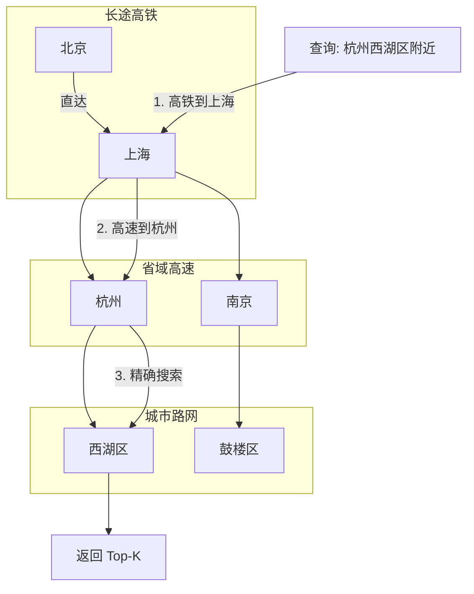

# 中文分词全文检索 + PostgreSQL 深度解析

> [!note|center] V3.3 做什么
> 将关键词检索从 MySQL `LIKE '%keyword%'`（全表扫描）升级为 PostgreSQL `tsvector + zhparser + GIN` 索引（倒排索引），搜索从 O(n) 进入 O(log n)。同时系统性地解析为什么 PostgreSQL 是 RAG 检索的首选数据库。

## 为什么 PostgreSQL 而不是 MySQL

这个问题的背后是两类索引机制的根本差异。MySQL 的核心索引是 **B+Tree**——它假设数据是一维的、可排序的，通过"值大小比较"来组织树形结构。但 RAG 的两种检索场景都超出 B+Tree 的能力范围：

| 检索场景 | B+Tree 能做吗 | 为什么不行 |
|------|------|------|
| 语义检索（向量相似度） | ❌ 不能 | 向量是 1024 维空间中的点，B+Tree 管一维大小比较，管不了 1024 维空间中的邻近距离 |
| 中文关键词检索 | ❌ 几乎不能 | `LIKE '%keyword%'` 前后都有通配符，B+Tree 无法定位起始位置，退化为全表扫；且不懂分词 |
| 数组/JSONB 包含查询 | ❌ 不能 | `WHERE tags @> '["java"]'` 是"包含"关系，不是大小比较，B+Tree 不擅长 |

PostgreSQL 额外提供 B+Tree 无法提供的索引：

```
MySQL：B+Tree 打天下（一维排序）
              ↓
        遇到向量、全文、JSONB → 全部退化为全表扫描

PostgreSQL：B+Tree + HNSW + GIN + GiST（每种专门优化一种场景）
              ↓
        向量有 HNSW，全文有 GIN + tsvector，JSONB 有 GIN
```

**面试回答要点：** 不是"PostgreSQL 比 MySQL 快"，而是"PostgreSQL 为向量和高维文本搜索提供了专用索引结构，避免了全表扫描"。

## pgvector：向量存储的底层实现

### 为什么不用 InMemory

V2 的 `InMemoryEmbeddingStore` 底层就是一个 `List<Embedding>` + 每次查询遍历全量计算余弦距离。三个硬伤：

1. **内存天花板**：所有向量常驻 JVM 堆，无法水平扩展
2. **O(n) 暴力搜索**：每个查询要和全量向量比较，chunk 上万时延迟不可接受
3. **重启丢失**：数据无持久化，重启应用要重新 Embedding 所有文档

### HNSW 索引原理（面试重点）

HNSW（Hierarchical Navigable Small World）是一种**近似最近邻搜索**的多层图索引。理解它的最好方式是类比"交通网络"：



类比到向量搜索：顶层（高铁）只有少量长距离边，负责跨区域跳跃定位；底层（城市路网）包含全部节点，负责精确搜索。查询过程只需要少数几次跳跃 + 少量精确比较，全程不需要碰全量数据。

```
复杂度：
  暴力遍历：O(n × 1024)  —— 每个查询计算 n 次 1024 维余弦距离
  HNSW   ：O(log n × 1024) —— 对数级跳跃，实际常数级
```

### pgvector 的 SQL 实现

我们没用任何第三方 pgvector SDK（`langchain4j-pgvector` 在 1.14.0 不存在），直接手写 JDBC SQL：

**写入向量：** JDBC 不识别 `vector` 类型，先把 `float[]` 转成 `[0.1, 0.2, ...]` 字符串，再通过 `?::vector` 让 pgvector 做类型转换：

```sql
INSERT INTO chunk_search (chunk_id, embedding, ...)
VALUES (?, ?::vector, ...)  -- ? 是 "[0.1,0.2,...]" 字符串
```

**语义检索：** `<=>` 是 pgvector 的余弦距离运算符。`1 - (<=>)` 转为相似度：

```sql
SELECT chunk_id, ..., 1 - (embedding <=> ?::vector) AS score
FROM chunk_search
ORDER BY embedding <=> ?::vector
LIMIT 10
```

| 运算符 | 含义 | 返回范围 |
|------|------|------|
| `<=>` | 余弦距离 | 0~2（0=同方向，2=反方向） |
| `<->` | 欧氏距离 | 0~∞（0=完全相同） |
| `<#>` | 内积 | 负值表示远 |

**建索引：**

```sql
CREATE INDEX idx_embedding ON chunk_search
    USING hnsw (embedding vector_cosine_ops);
```

`vector_cosine_ops` 指定用余弦距离构建 HNSW 图。建好之后 `ORDER BY embedding <=> queryVec` 自动走索引，不再遍历全表。

## zhparser + tsvector：中文分词全文检索

### 为什么不用 LIKE

MySQL `LIKE '%存储引擎%'` 的问题不在于 MySQL，在于这个操作本身：

```
SELECT * FROM chunk WHERE content LIKE '%存储引擎%'
```

数据库的索引本质上是"有序排列 + 快速定位"。`LIKE 'abc%'` 能用索引（知道从 'abc' 开头的地方开始），但 `LIKE '%abc%'` 不知道——因为 abc 可能出现在任何位置，无法用树形索引定位起点，只能从头扫到尾。每行都做一次字符串匹配，O(n)。

### 倒排索引原理（面试重点）

倒排索引像一本书末尾的索引页：

```
原书内容：
  p.23: "HashMap 采用数组 + 链表实现"
  p.89: "ConcurrentHashMap 在 JDK 1.8 中..."
  p.156: "HashMap 的 put 操作线程不安全"

索引页：
  HashMap         → p.23, p.156
  ConcurrentHashMap → p.89
  数组            → p.23
  链表            → p.23
  线程不安全      → p.156
```

查"HashMap"：翻索引 → p.23, p.156 → 直接定位。O(log n)。

```
倒排索引 vs 正排索引：

正排（常规索引）：
  chunk_id → content
  1 → "HashMap 采用数组 + 链表实现"
  2 → "ConcurrentHashMap 在 JDK 1.8 中..."

倒排（GIN 索引）：
  词 → chunk_ids
  HashMap → [1, 3, 7]
  InnoDB  → [5, 8]
```

### zhparser 中文分词

英文天然用空格分词（`InnoDB / storage / engine`），中文没有空格（`InnoDB存储引擎`）。zhparser 基于 scws（Simple Chinese Word Segmentation）做中文分词：

```
输入："InnoDB 存储引擎的特点"
     ↓ zhparser 分词
输出：["InnoDB", "存储", "引擎", "的", "特点"]
     ↓ to_tsvector('chinese', content)
tsvector：'InnoDB':1 '存储':2 '引擎':3 '特点':5
     ↓ 建立 GIN 倒排索引
InnoDB → chunk-1, chunk-5, chunk-12
存储   → chunk-1, chunk-3, chunk-7
引擎   → chunk-1, chunk-9, chunk-15
```

SQL 实现：

```sql
-- 插入时自动生成 tsvector
INSERT INTO chunk_search (..., content_tsv)
VALUES (..., to_tsvector('chinese', content));

-- 检索：tsquery 解析查询词，@@ 做全文匹配，ts_rank 算相关性
SELECT ..., ts_rank(content_tsv, to_tsquery('chinese', 'InnoDB & 存储 & 引擎')) AS score
FROM chunk_search
WHERE content_tsv @@ to_tsquery('chinese', 'InnoDB & 存储 & 引擎')
ORDER BY score DESC;
```

`&` 是 AND 语义——三个词都要命中。加上 GIN 索引后，每个词直接从倒排列表中找，不用扫全表。

### 分词效果验证

搜索"存储引擎" vs "引擎存储"——结果完全不同。zhparser 真正理解词边界，不是简单的子串匹配。

## 一张表，双引擎

PostgreSQL 设想的终极场景是：**单一数据库解决所有检索需求**。我们的 `chunk_search` 表就体现了这个思想：

```
chunk_search 表
├── embedding ──→ HNSW 索引 ──→ 语义检索（余弦相似度）
├── content_tsv ──→ GIN 索引 ──→ 关键词全文检索（倒排索引）
└── module_tags ──→ GIN 索引 ──→ 按标签过滤
```

需要联表时——比如在某个文档范围内搜索特定标签的 chunk——PostgreSQL 可以在一次 B+Tree + GIN + HNSW 的复合查询中完成，而 MySQL 需要应用层做多步查询再拼接。这才是 PostgreSQL 真正的壁垒（不是"速度快"，而是"索引类型丰富，能用在同一条 SQL 里组合使用"）。

## 双数据源架构

```
MySQL（auto-configured）
  ├── source_document — 文档原文
  ├── document_chunk — 分块文本（业务真数据）
  └── message_job   — 异步索引消息追踪

PostgreSQL（内部 new HikariDataSource, 不暴露为 Bean）
  └── chunk_search  — 向量 + 全文 + 标签（检索引擎副本）
```

> [!tip] `PgVectorStore` 实现了两大接口
> `EmbeddingStore<TextSegment>` — 语义检索入口（被 `SemanticRetrieverImpl` 调用）  
> `IFullTextSearchRepository` — 全文检索入口（被 `KeywordRetrieverImpl` 调用）  
> 同一个对象、同一张表、双引擎复用

## 面试总结：PostgreSQL 在 RAG 中的三大优势

| 维度 | 方案 | 核心原理 |
|------|------|------|
| **向量检索** | pgvector HNSW 索引 | 多层图近似搜索，O(log n)，避免全量余弦距离计算 |
| **中文全文检索** | zhparser 分词 + tsvector + GIN 倒排索引 | 先分词建倒排，再查索引直接定位，O(log n) |
| **组合查询** | 单表多索引联合查询 | HNSW + GIN + B+Tree 可在同一条 SQL 中同时使用 |

**一句话回答"为什么不用 Elasticsearch"：** ES 是搜索引擎，擅长全文检索但向量能力是后期加入的（ANN 插件）；PostgreSQL + pgvector 是数据库 + 向量 + 全文三种能力原生融合在一张表里，数据不用同步两份、不用维护两套系统。适合团队规模小、数据量中等（百万级以下）的 RAG 场景。
