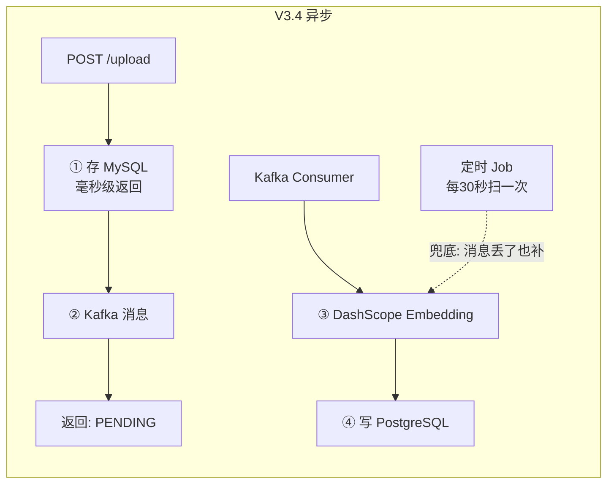

# 异步索引 + Kafka 消息驱动 + 兜底轮询

> [!note|center] V3.4 做什么
> 将 V2 的同步 Embedding（上传→分块→Embedding 一把梭在 `@Transactional` 里）拆为两步异步：上传时只做 MySQL 落库，Embedding 通过 Kafka 消息异步触发，并加入兜底轮询保证可靠性。

## 为什么要异步

V2 的上传链路：

```
POST /upload → ① 存 MySQL → ② 分块 → ③ DashScope Embedding API → 返回
                                                           ↑
                                           外部 API 调用，耗时不可控（2~30 秒）
                                           ← 全在 @Transactional 事务内 →
```

两个问题：
1. **用户等待时间 = 上传时间 + Embedding API 响应时间**——上传一个大文档可能要等几十秒
2. **Embedding 失败导致整条事务回滚**——文档和分块明明已经存好了，就因为 Embedding 网络超时而全部作废



## 消息驱动：Kafka

### Topic 设计

```
Topic: document.indexing
  ├── Key: documentId（UUID，保证同文档消息有序）
  └── Value: JSON
        {
          "type": "CHUNK_EMBED",
          "documentId": "uuid-xxx",
          "chunkCount": 13,
          "timestamp": "2026-06-12T14:00:00"
        }
```

### 生产者（KafkaIndexingProducer）

上传完成后发送一条消息——这件事在 `@Transactional` 内完成，和 MySQL 写入共用一个事务。要么文档+分块+消息全部成功，要么全部回滚：

```java
@Transactional(rollbackFor = Exception.class)
public SourceDocumentEntity uploadDocument(String fileName, String content) {
    // ① 存文档 + 分块
    SourceDocumentEntity saved = documentRepository.save(entity);
    List<DocumentChunkEntity> chunks = markdownChunker.chunk(saved);
    chunkRepository.saveAll(chunks);

    // ② 发 Kafka 消息 + 记 message_job
    indexingProducer.sendChunkEmbedMessage(saved.getId(), chunks.size());
    messageJobRepository.savePending(saved.getId(), "document.indexing");

    return saved;  // ← 秒级返回
}
```

### 消费者（IndexingConsumer）

独立线程消费，失败不影响上传流程。消息是 JSON 字符串，用 fastjson2 解析：

```java
@KafkaListener(topics = "document.indexing", groupId = "qa-agent-indexing")
public void onMessage(String message) {
    JSONObject msg = JSON.parseObject(message);
    String documentId = msg.getString("documentId");

    documentService.embedDocumentChunks(documentId);  // 异步执行 Embedding
    messageJobRepository.updateStatus(documentId, "COMPLETED", null);
}
```

## 消息追踪：message_job 表

用 MySQL 的 `message_job` 表记录每条消息的处理状态：

| 状态 | 含义 | 后续动作 |
|------|------|------|
| `PENDING` | 消息已发送，等待消费 | 定时 Job 重试 |
| `COMPLETED` | Embedding 成功 | 无 |
| `FAILED` | 超过重试次数 | 日志告警，手动干预 |

每条记录包含 `retry_count`，每次失败自增，超过 3 次不再重试。

## 兜底轮询：MessageRetryJob

Kafka 消息理论上不会丢，但万一宕机、网络超时、消费者异常——总需要一个兜底方案：

```java
@Scheduled(fixedRate = 30_000)  // 每 30 秒
public void retryPendingMessages() {
    List<String> pendingIds = messageJobRepository.findPendingOrFailed(3);
    for (String documentId : pendingIds) {
        documentService.embedDocumentChunks(documentId);
        messageJobRepository.updateStatus(documentId, "COMPLETED", null);
    }
}
```

这和 Kafka 消费者形成双保险：
- **主路径**：Kafka Consumer 实时消费（秒级延迟）
- **兜底路径**：定时 Job 扫描 PENDING/FAILED（最多 30 秒延迟）

两者不会冲突——消费者成功后把状态改为 `COMPLETED`，Job 下次扫描就跳过了。

## API 变更

| API | 方法 | 说明 |
|------|------|------|
| `GET /document/{id}/embedding-status` | GET | 查询 Embedding 进度：PENDING/COMPLETED/FAILED |
| `POST /document/{id}/re-embed` | POST | 手动触发重建（编辑文档后），UPSERT 覆写旧向量 |

## DDD 层间解耦

V3.4 的一个重要改进：domain 层不再直接依赖 MyBatis-Plus 的 DAO：

```
DocumentController (trigger)
  └─→ IDocumentService (domain)
        ├─→ IIndexingMessageProducer (domain 接口)
        │     └─→ KafkaIndexingProducer (infra 实现)
        └─→ IMessageJobRepository (domain 接口)
              └─→ MessageJobRepositoryImpl (infra 实现)

IndexingConsumer (trigger)
  └─→ IDocumentService + IMessageJobRepository

MessageRetryJob (trigger)
  └─→ IDocumentService + IMessageJobRepository
```

`trigger` 和 `domain` 层都只依赖接口，`infra` 层做具体实现。`PgVectorStore` 同时实现 `EmbeddingStore<TextSegment>` 和 `IFullTextSearchRepository`，实现了单表双引擎复用。
