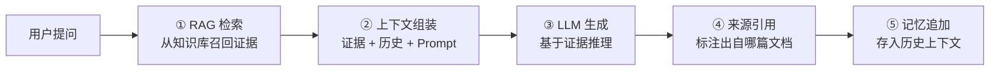
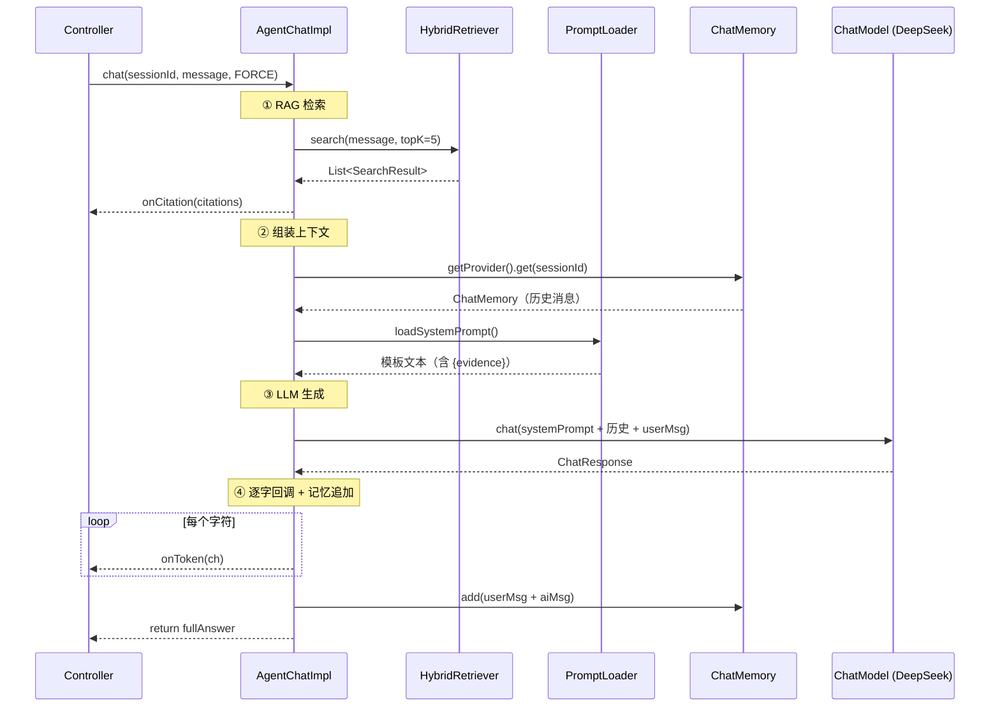

# RAG Agent 核心问答 + 多轮记忆 + Prompt 管理

> [!note|center] V4.1 做什么
> 在 V2 RAG 检索和 V3 PostgreSQL 检索引擎的基础上，搭建 Agent 智能问答层。用户提问 → Agent 自动检索知识库 → 结合证据生成回答 → 标注来源引用 → 支持多轮对话记忆。

## Agent 和普通 Chat 的区别

普通 Chat 是"用户问一句，LLM 凭记忆回答"——完全依赖模型训练时见过的数据，可能胡编乱造。

RAG Agent 多了两步关键动作：



对比：

| | V1 ChatController | V4 AgentChat |
|------|------|------|
| 检索 | 无 | RAG Pipeline（语义+关键词+RRF+Rerank） |
| Prompt | 无 System Prompt | 外置模板 + `{evidence}` 动态注入 |
| 记忆 | 无 | `MessageWindowChatMemory` 多轮上下文 |
| 引用 | 无 | 每条回答附 `chunkId + titlePath + documentId` |
| 拒答 | 无（硬编） | 证据不足时回复"暂未找到相关内容" |

## 新领域：agent 域

V4 在 domain 层新建了 `agent` 限界上下文，和 `document` 平级：

```
domain/agent/
├── model/
│   ├── entity/AgentMessage.java        ← 对话消息
│   └── valobj/
│       ├── Citation.java               ← 来源引用
│       └── RetrievalMode.java          ← FORCE / TOOL
├── service/
│   ├── chat/
│   │   ├── IAgentChat.java             ← 核心对话接口
│   │   └── AgentChatImpl.java          ← 编排实现
│   ├── memory/
│   │   ├── IAgentMemory.java           ← 记忆接口
│   │   └── AgentMemoryImpl.java        ← MessageWindowChatMemory
│   └── prompt/
│       └── IPromptLoader.java          ← Prompt 加载接口
```

## 核心链路：AgentChatImpl



## 多轮记忆：MessageWindowChatMemory

LangChain4j 的 `ChatMemory` 负责维护对话历史。V4.1 用了最简单的滑动窗口方案：

```java
@Component
public class AgentMemoryImpl implements IAgentMemory {
    private static final int MAX_MESSAGES = 20;

    @Override
    public ChatMemoryProvider getProvider() {
        return memoryId -> MessageWindowChatMemory.withMaxMessages(MAX_MESSAGES);
    }
}
```

- `ChatMemoryProvider` 是工厂函数，根据 `memoryId`（即 `sessionId`）返回对应的 `ChatMemory`
- `MessageWindowChatMemory` 是滑动窗口——只保留最近 20 条消息，超出自动丢弃
- 不同 session 的记忆互不干扰

在 `AgentChatImpl` 中的使用：

```java
// 获取历史
ChatMemory memory = agentMemory.getProvider().get(sessionId);
List<ChatMessage> history = memory.messages();  // 最近 20 条

// 追加新消息
memory.add(userMsg);
memory.add(aiMsg);  // 对话结束时追加
```

## Prompt 外置管理 + 热更新

Prompt 放在 `src/main/resources/prompts/agent-system-prompt.md`，通过 `ClassPathResource` 每次调用实时读取：

```java
@Component
public class PromptLoaderImpl implements IPromptLoader {
    private static final String PROMPT_PATH = "prompts/agent-system-prompt.md";

    @Override
    public String loadSystemPrompt() {
        ClassPathResource resource = new ClassPathResource(PROMPT_PATH);
        String content = resource.getContentAsString(StandardCharsets.UTF_8);
        return content;
    }
}
```

每次 Agent 对话都重新读取文件——这意味着修改 `prompts/agent-system-prompt.md` 后热部署即刻生效，无需重启应用。

当前 Prompt 模板结构：

```markdown
你是一个技术知识库助手，专门回答用户学习中遇到的问题。

## 核心规则
1. **必须基于证据回答**：不能凭空编造
2. **标注来源**：回答末尾列出引用
3. **保持简洁**：直接回答问题

## 检索证据
{evidence}
```

`{evidence}` 占位符被检索结果替换为：

```
---
来源: MySQL 存储引擎 > InnoDB > B+Tree 索引
内容: InnoDB 采用 B+Tree 作为其索引结构，特点是...

---
来源: MySQL 存储引擎 > InnoDB > 事务
内容: InnoDB 支持 ACID 事务，通过 MVCC 实现...
```

## 来源引用

Agent 回答不仅返回文本，还附带每条证据的溯源信息：

```json
{
  "chunkId": "uuid-xxx",
  "documentId": "uuid-yyy",
  "titlePath": "MySQL 存储引擎 > InnoDB > B+Tree 索引",
  "snippet": "InnoDB 采用 B+Tree 作为其索引结构..."
}
```

这让用户可以追溯答案来源——知道 LLM 的每句话是从哪篇文档的哪个章节推出来的。这也是 RAG 相比纯 LLM 的核心优势：**答案可追溯**。

## SSE 流式推送

Controller 将 `AgentChatImpl.chat()` 的回调转为 SSE 事件推送：

```
event: citation
data: [{"chunkId":"...","titlePath":"...","snippet":"..."}]

event: token
data: I

event: token
data: nnoDB

event: token
data:  是

...（逐字推送）

event: done
data: {"sessionId":"uuid-xxx"}
```

`CompletableFuture.runAsync()` 把 Agent 调用放到独立线程，主线程立即返回 `SseEmitter`。这样前端不会因为等待 LLM 响应而超时。

## 检索模式

| 模式 | 行为 | 适用场景 |
|------|------|------|
| `FORCE`（默认） | 每次对话都先 RAG 检索再生成 | 学习问答，必须基于知识库 |
| `TOOL`（V4.2） | LLM 自主判断是否需要检索 | 闲聊 + 知识混合场景 |

前端通过 `retrievalMode` 参数控制。

## 和 V2 ChatController 的关系

V1 的 `ChatController`（`POST /api/v1/chat`）是纯 LLM 对话——没有 RAG、没有记忆、没有引用。V4 的 `AgentController`（`POST /api/v1/agent/chat`）是完整的 RAG Agent。两者可以并存——前者适合快速测试模型连通性，后者是正式的知识库问答入口。

## 后续优化（可选）

- **长期记忆**：`ChatMemoryStore` 持久化到 MySQL，跨会话保留知识上下文
- **摘要压缩**：当对话超过窗口限制时，用 LLM 把历史摘要压缩而非直接丢弃
