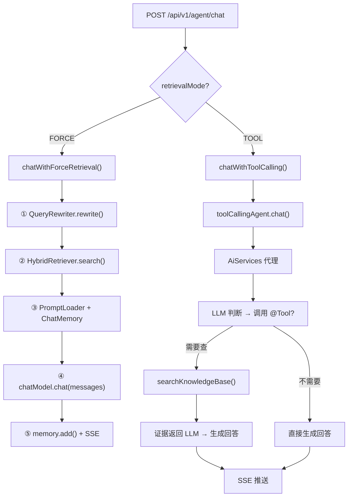

# Tool Calling + AiServices 动态代理 + MCP 工具

> [!quote]+ Tool Calling 是什么
> 前面的 V4.1/V4.2 中，Agent 使用 **FORCE 检索模式**——每次对话强制走一遍"改写→检索→组装→生成"流程。这个模式对知识库问答很合适，但存在两个问题：
> 
> 1. **所有问题都走检索链路**：即使用户只是说句"你好"，也会触发一次无意义的 RAG 检索
> 2. **LLM 没有自主权**：不管 LLM 内部判断是否需要查资料，流程被硬编码了
> 
> **Tool Calling（函数调用）**让 LLM 拥有了决策权——把知识库检索包装为一个"工具"，LLM 看到用户问题后，**自己判断需不需要调用这个工具**，就像人类助手接到问题后判断"这个问题我需要翻笔记查一下"还是"这个可以直接回答"。

## 核心原理：AiServices 动态代理

这是整个 V4.3 的核心机制，也是我刚开始没理解的部分——**我们只写了一个接口 `IToolCallingAgent`，没有任何实现类，但 LangChain4j 在运行时自动生成了代理对象**。

### 和 MyBatis Mapper 的类比

如果用过 MyBatis-Plus，应该对这模式不陌生：

```java
// MyBatis：只定义接口，不写实现
public interface SourceDocumentDao extends BaseMapper<SourceDocumentPO> {
}
// → 运行时 MyBatis 自动生成代理，生成 SELECT/INSERT/UPDATE SQL

// LangChain4j AiServices：只定义接口，不写实现
public interface IToolCallingAgent {
    @SystemMessage(fromResource = "prompts/tool/system-prompt.md")
    String chat(@MemoryId String memoryId, @UserMessage String userMessage);
}
// → 运行时 LangChain4j 自动生成代理，串联 ChatModel + ChatMemory + @Tool
```

> [!note]+ 动态代理做了什么事
> `AiServices.builder().build()` 返回的对象，本质是一个 **JDK 动态代理**。当你调用 `agent.chat(sessionId, "InnoDB 是什么")` 时，代理内部执行了以下步骤：
> 
> 1. **读取注解**：扫 `@SystemMessage(fromResource = "...")`，加载外部 Prompt 文件
> 2. **获取记忆**：根据 `@MemoryId` 参数，调 `ChatMemoryProvider.get(sessionId)` 拿到历史消息
> 3. **扫描工具**：扫传入的 `knowledgeBaseTool` 对象上所有 `@Tool` 注解的方法，转成 OpenAI Function Calling 的函数定义 JSON
> 4. **请求 LLM**：把 System Prompt + 历史消息 + 用户消息 + 工具定义 一起发给 ChatModel
> 5. **处理响应**：如果 LLM 返回 `tool_call` → 代理自动调 `@Tool` 方法 → 把返回结果再发给 LLM → 生成最终回答
> 6. **返回结果**：把最终回答文本返回给调用方

### 构造时机

```java title:"AgentChatImpl 构造器"
this.toolCallingAgent = AiServices.builder(IToolCallingAgent.class)
        .chatModel(chatModel)                          // ① 绑定 DeepSeek ChatModel
        .chatMemoryProvider(agentMemory.getProvider())  // ② 绑定记忆管理器
        .tools(knowledgeBaseTool)                       // ③ 注册 MCP 工具
        .build();                                       // ④ 生成代理
```

在构造器里一次性创建，存为 `final` 字段，后续所有 TOOL 模式的对话复用同一个代理。

## MCP 工具层

V4.3 新增了 `service/mcp/` 包，专门存放 Agent 可调用的工具：

```
domain/agent/service/mcp/
  agent/
    IToolCallingAgent.java        ← AiServices 代理接口
  tool/
    KnowledgeBaseSearchTool.java  ← @Tool 注解的工具类
```

### @Tool 注解

```java title:"KnowledgeBaseSearchTool.java"
@Slf4j
@Component
public class KnowledgeBaseSearchTool {

    private final HybridRetrieverImpl hybridRetriever;

    @Tool("在用户的知识库（Markdown 学习笔记）中搜索相关内容。" +
          "当用户询问技术问题、概念解释、代码用法等可能需要查资料的问题时调用。" +
          "query 参数使用关键词形式，如 'InnoDB 索引原理'。")
    public String searchKnowledgeBase(String query) {
        List<SearchResult> results = hybridRetriever.search(query, 5, true);
        // 拼装成 LLM 能读的文本格式返回
    }
}
```

> [!tip] `@Tool` 注解的 description 很重要
> LLM 根据 `@Tool` 注解中的 **description** 来判断"什么时候该调用这个工具"。如果 description 写得不清楚，LLM 可能在需要调用时不调用，或者在不该调用时调用。这个 description 本质就是 **给 LLM 看的"工具使用说明"**。

`@Tool` 方法做的事：接收 LLM 传的参数 → 调现有 Service → 返回文本结果。**工具层只是薄封装，不改原有 Service 代码**。这就是 MCP 模式的核心——外部工具通过标准接口接入，内部服务不感知调用来源。

### OpenAI Function Calling 协议

当 AiServices 代理发送请求给 DeepSeek 时，请求体中会附带 tools 定义：

```json
{
  "model": "deepseek-v4-pro",
  "messages": [...],
  "tools": [
    {
      "type": "function",
      "function": {
        "name": "searchKnowledgeBase",
        "description": "在用户的知识库中搜索相关内容...",
        "parameters": {
          "type": "object",
          "properties": {
            "query": {
              "type": "string",
              "description": "检索关键词"
            }
          },
          "required": ["query"]
        }
      }
    }
  ]
}
```

LLM 看到这段工具定义 → 判断用户问题 → 决定是否返回 `tool_calls` → 代理拦截执行 → 结果发回 LLM → 生成最终回答。

## 两种模式对比

V4 的 Agent 现在支持两种检索模式，前端通过 `retrievalMode` 参数切换：

| | FORCE（强制检索） | TOOL（Tool Calling） |
|------|------|------|
| 触发方式 | 每次都走 RAG | LLM 自主判断 |
| 检索链路 | rewrite → search → prompt → generate | AiServices 代理自动编排 |
| 引用 | 有（SearchResult → Citation） | 无（LLM 调用时机不确定） |
| 适用场景 | 学习问答（必须基于资料） | 混合场景（闲聊+知识） |
| 实现方式 | 手写编排链路 | `@Tool` + `AiServices` |
| 额外 LLM 调用 | 2 次（改写 + 回答） | 1~3 次（回答 + 可能的工具调用） |

> [!warning] TOOL 模式的限制
> 由于 LLM 可以自主决定调用时机（可能在对话中间查一次、也可能不查），**TOOL 模式无法提供结构化的来源引用（Citation）**。如果需要引用的场景，优先用 FORCE 模式。

## Prompt 管理

V4.3 将所有 Prompt 统一迁移到分类文件夹下：

```
prompts/
  agent/system-prompt.md       ← FORCE 模式 System Prompt [{evidence} 占位符]
  rewrite/query-rewriter.md    ← 查询改写 Prompt
  tool/system-prompt.md        ← TOOL 模式 System Prompt [fromResource 自动加载]
```

三者的加载方式不同：
- `agent/system-prompt.md` → `PromptLoaderImpl` 手动读 `ClassPathResource`
- `rewrite/query-rewriter.md` → `QueryRewriterImpl` 手动读 `ClassPathResource`
- `tool/system-prompt.md` → `@SystemMessage(fromResource = "...")` LangChain4j 自动读

> [!info]+ `fromResource` 热更新
> LangChain4j 的 `@SystemMessage(fromResource = "...")` 在每次代理调用时都重新读取文件内容。这意味着你把 `tool/system-prompt.md` 改了以后，下一次对话即刻生效——不需要重启、不需要重新构建代理。

## AgentChatImpl 最终架构



左侧 FORCE 是手写编排，右侧 TOOL 是框架代理——两种模式并存，接口统一。
