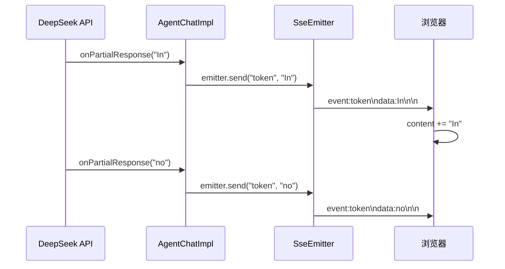
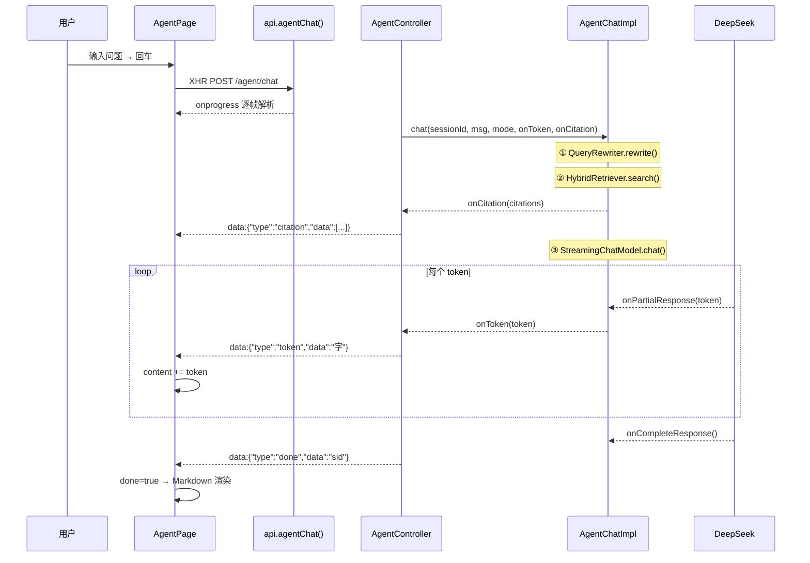

# Agent SSE 流式对话 + 打字机效果

> [!note]+ V5.3 做什么
> 把 Agent 对话从"等 LLM 完整返回 → 一次性推给前端"改为"LLM 生成一个字推一个字"的真流式体验。同时解决 Markdown 渲染、换行、Emoji 显示等前后端协作问题。

## 真流式 vs 伪流式

这是 V5.3 最核心的决策问题——什么时候能实现真正的流式传输，什么时候只能模拟。

### 真流式（LLM 生成一个字 → 推一个字）



**前提条件：** 必须使用 `StreamingChatModel`（LangChain4j 的流式接口）调用 LLM，它通过 `onPartialResponse(String token)` 回调逐 token 推送。

**适用场景：**
- `OpenAiChatModel` 底层支持的 `/v1/chat/completions` 接口添加 `stream: true`
- LangChain4j 的 `OpenAiStreamingChatModel` 封装了这个能力
- **FORCE 模式**使用了这个方案

**核心代码：**

```java
streamingChatModel.chat(allMessages, new StreamingChatResponseHandler() {
    @Override public void onPartialResponse(String token) {
        onToken.accept(token);  // 每个 token 直接推送 SSE
    }
    @Override public void onCompleteResponse(ChatResponse response) {
        // 流式结束，追加到记忆
        memory.add(userMsg);
        memory.add(response.aiMessage());
    }
});
```

### 伪流式（等 LLM 完整返回 → 手动拆字 → 加延迟推送）

**前提条件：** `ChatModel` 的同步 `chat()` 方法，或 `AiServices` 代理——它们都是等 LLM 完整返回后才拿到结果。

**为什么 TOOL 模式只能用伪流式：** LangChain4j 1.14.0 的 `AiServices`（`@Tool` + Function Calling）只接受 `ChatModel`（同步接口），不接受 `StreamingChatModel`。这是框架层的限制——`AiServices.builder().chatModel(chatModel)` 只能是同步 ChatModel。未来 LangChain4j 版本如果支持 `AiServices.builder().streamingChatModel()`，TOOL 模式也能享受真流式。

```java
// TOOL 模式的伪流式实现
String fullAnswer = agentAssistant.chat(sessionId, userMessage);  // 同步等待完整回答
for (char c : fullAnswer.toCharArray()) {
    onToken.accept(String.valueOf(c));
    Thread.sleep(30);  // 模拟打字机节奏
}
```

> [!warning] 两种模式的差异
> | | FORCE（真流式） | TOOL（伪流式） |
> |------|------|------|
> | 底层模型 | `OpenAiStreamingChatModel` | `OpenAiChatModel`（AiServices 限制） |
> | 首字延迟 | ~0.5s（LLM 第一个 token 到达） | 完整回答时间 + 拆字延迟 |
> | 用户体感 | 真实的"AI 在思考并逐字输出" | "AI 想完了，模拟逐字输出" |
> | 检索方式 | 代码强制 RAG → 注入 Prompt | LLM 自主调用 `@Tool` → `KnowledgeSearchTool.searchKnowledgeBase()` |
> | 将来可否真流式 | ✅ 已经是 | ⏳ 等 LangChain4j AiServices 支持 StreamingChatModel |

## SSE 格式设计

后端和前端之间的 SSE 协议——去掉了 LangChain4j 默认的 `event:` 前缀，只用 `data:` + JSON：

```
data:{"type":"token","data":"字"}

data:{"type":"citation","data":[{...}]}

data:{"type":"done","data":"sessionId"}
```

### 字符级 token 的坑

**问题 1：换行符丢失**

`\n` 字符在 SSE 的 `data:` 行内是特殊字符——SSE 以 `\n\n` 为帧分隔符。如果在 token 中直接传 `\n`，会被当做帧分隔符吃掉。

```
// 后端会把 data:\n 解析为空白 data 行 → onToken 不会被调用
```

解法：后端替换 `\n` → `[BR]` 标记，前端解码回来：

```java
// AgentChatImpl
onToken.accept(token.replace("\n", "[BR]"));
```

```typescript
// AgentPage
content: m.content + t.replace(/\[BR\]/g, "\n")
```

**问题 2：空格被吃掉**

SSE 解析器为了处理 `data: {"type":...}`（JSON 前有空格），习惯性地做了 `.replace(/^\s/, "")` 移除前导空白。但 token 是 `data: " "`（一个空格）时，前导空格被吞掉，`## 标题` 变成 `##标题`，Markdown 渲染失败。

解法：只对非 token 事件做 trim：

```typescript
const d = eType === "token" ? raw : raw.replace(/^\s/, "");
```

**问题 3：Emoji 编码**

Emoji 如 `📚` 是多字节 UTF-8 字符，SSE 的 `produces` 必须显式指定 `charset=UTF-8`，否则可能被 `ISO-8859-1` 编码导致前端显示 `??`。

```java
@PostMapping(value = "/chat", produces = "text/event-stream;charset=UTF-8")
```

## 前端打字机效果

### 状态管理——不可变更新

React StrictMode 在开发模式下会**双重调用** `setState` 回调。如果直接在原对象上 `last.content += t`，每个 token 会被追加两次 → 字符翻倍。

```typescript
// ❌ 突变对象——StrictMode 下每个 token 追加两次
(t) => setMsgs((p) => { const n = [...p]; n[n.length-1].content += t; return n; })

// ✅ 不可变——返回全新对象
(t) => setMsgs((p) => p.map((m, i) =>
  i === p.length - 1 && m.role === "ASSISTANT"
    ? { ...m, content: m.content + t.replace(/\[BR\]/g, "\n") }
    : m
))
```

### 流式期间 vs 完成后的显示

```tsx
{m.done ? (
  // 完成 → Markdown 渲染（react-markdown + remark-gfm + remark-breaks）
  <MdViewer content={m.content} maxLen={99999} />
) : (
  // 流式中 → 纯文本 + 闪烁光标（whitespace-pre-wrap 保留换行）
  <div className="...whitespace-pre-wrap">{m.content}<span className="animate-pulse">▌</span></div>
)}
```

`remark-breaks` 让单 `\n` 也能换行（默认只有 `\n\n` 才分段），LLM 输出的 Markdown 才能正常渲染标题、列表和代码块。

## 前后端完整链路



## 多轮记忆

`IAgentMemory` 封装了 LangChain4j 的 `ChatMemoryProvider`，每个 session 维护最近 20 条消息。这是纯内存方案——重启丢失，但对于对话场景足够了。

```java
// domain/agent/service/memory/AgentMemoryImpl.java
public ChatMemoryProvider getProvider() {
    return memoryId -> MessageWindowChatMemory.withMaxMessages(20);
}
```

- `memoryId` = `sessionId`——不同会话的记忆自动隔离
- `MessageWindowChatMemory` 是滑动窗口，超出 20 条自动丢弃最早的消息
- FORCE 和 TOOL 模式共享同一套记忆机制
